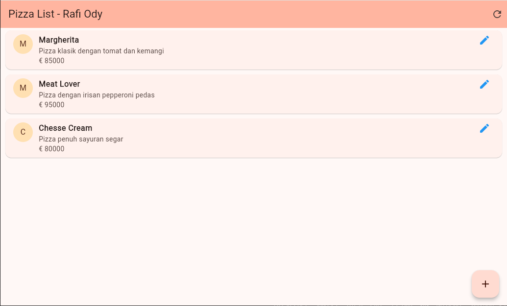
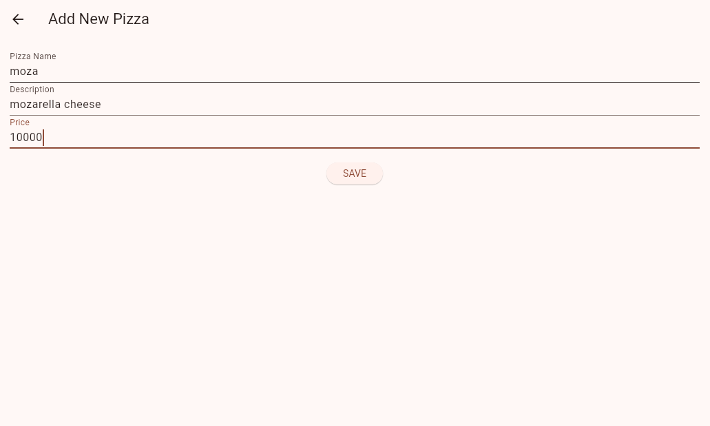
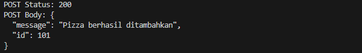
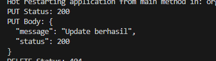
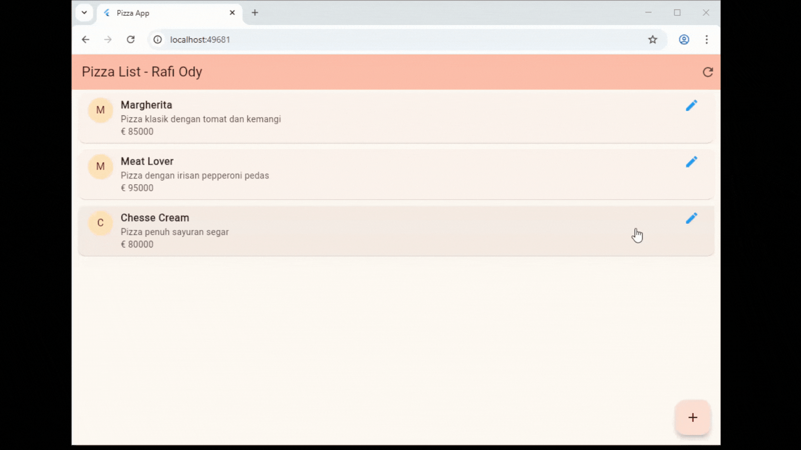

# Praktikum 14

## Informasi Praktikum
- **Nama**: Rafi Ody Prasetyo
- **NIM**: 2341720180
- **Kelas**: TI-3F

---

# Mobile Programming - JSON & HTTP Request

Repository ini berisi implementasi praktikum Mobile Programming menggunakan Flutter untuk melakukan operasi CRUD (Create, Read, Update, Delete) ke Mock API (WireMock).

---

# Praktikum 1: Mengambil Data dari Web Service (GET)

### Langkah 1: Persiapan Layanan Mock API (WireMock)

Sebelum masuk ke koding, kita perlu menyiapkan "server bohong-bohongan" (Mock API) agar aplikasi memiliki sumber data.

1.  Buka [WireMock Cloud](https://app.wiremock.cloud/) (sebelumnya MockLab).
2.  Daftar (Sign Up) dan Login.
3.  Buat **New Mock API**. Pilih nama bebas (misal: `PizzaAPI`).
4.  Setelah masuk dashboard, catat **Base URL** Anda (biasanya terlihat di atas, misal: `https://xyz123.wiremock.cloud`). **Ini sangat penting.**
5.  Klik menu **Stubs** > **Create new stub**.
6.  Isi konfigurasi berikut:
    * **Method:** `GET`
    * **URL Path:** `/pizzalist`
    * **Response Status:** `200`
    * **Response Body (Type):** `JSON`
7.  Copy-paste JSON berikut ke dalam Body (ini simulasi dari `bit.ly/pizzalist` agar sesuai dengan model data kita nanti):

```json
[
    {
        "id": 1,
        "pizzaName": "Margherita",
        "description": "Pizza klasik dengan tomat dan kemangi",
        "price": 85000,
        "imageUrl": "img/margherita.png"
    },
    {
        "id": 2,
        "pizzaName": "Pepperoni",
        "description": "Pizza dengan irisan pepperoni pedas",
        "price": 95000,
        "imageUrl": "img/pepperoni.png"
    },
    {
        "id": 3,
        "pizzaName": "Veggie Supreme",
        "description": "Pizza penuh sayuran segar",
        "price": 80000,
        "imageUrl": "img/veggie.png"
    }
]
```

8.  Klik **Save**.

### Langkah 2: Struktur Proyek & Dependensi

Pastikan sudah membuat project Flutter baru.

**Struktur Direktori:**

```text
basic_layout_flutter/
├── lib/
│   ├── httphelper.dart   <-- Untuk koneksi API
│   ├── main.dart         <-- UI Utama
│   └── pizza.dart        <-- Model Data (Perlu dibuat)
├── pubspec.yaml
└── README.md
```

**Instalasi Dependensi:**
Buka terminal di root project Anda dan jalankan:

```bash
flutter pub add http
```

### Langkah 3: Implementasi Kode

#### 1. File `lib/pizza.dart`

File ini wajib ada karena dipanggil di `httphelper.dart` (metode `Pizza.fromJson`).

```dart
class Pizza {
  final int id;
  final String pizzaName;
  final String description;
  final double price;
  final String imageUrl;

  Pizza({
    required this.id,
    required this.pizzaName,
    required this.description,
    required this.price,
    required this.imageUrl,
  });

  factory Pizza.fromJson(Map<String, dynamic> json) {
    return Pizza(
      id: json['id'] ?? 0,
      pizzaName: json['pizzaName'] ?? '',
      description: json['description'] ?? '',
      // Menangani kemungkinan harga dalam int atau double
      price: (json['price'] as num?)?.toDouble() ?? 0.0,
      imageUrl: json['imageUrl'] ?? '',
    );
  }
}
```

#### 2. File `lib/httphelper.dart`

**PENTING:** Ganti nilai variabel `authority` dengan domain WireMock Anda sendiri (tanpa `https://` dan tanpa `/pizzalist`).

```dart
import 'dart:io';
import 'package:http/http.dart' as http;
import 'dart:convert';
import 'pizza.dart';

class HttpHelper {
  // Pola Singleton
  static final HttpHelper _httpHelper = HttpHelper._internal();
  
  HttpHelper._internal();

  factory HttpHelper() {
    return _httpHelper;
  }

  // GANTI INI dengan domain WireMock Anda!
  final String authority = 'ganti_dengan_id_anda.wiremock.cloud'; 
  
  final String path = 'pizzalist';

  Future<List<Pizza>> getPizzaList() async {
    final Uri url = Uri.https(authority, path);
    
    // Debugging: print URL untuk memastikan benar
    print("Connecting to: $url"); 

    final http.Response result = await http.get(url);

    if (result.statusCode == HttpStatus.ok) {
      final jsonResponse = json.decode(result.body);
      
      List<Pizza> pizzas = jsonResponse.map<Pizza>((i) => 
        Pizza.fromJson(i)).toList();
      
      return pizzas;
    } else {
      print("Failed to load data: ${result.statusCode}");
      return [];
    }
  }
}
```

#### 3. File `lib/main.dart`

```dart
import 'package:flutter/material.dart';
import 'httphelper.dart';
import 'pizza.dart';

void main() {
  runApp(const MyApp());
}

class MyApp extends StatelessWidget {
  const MyApp({super.key});

  @override
  Widget build(BuildContext context) {
    return MaterialApp(
      title: 'Flutter Demo',
      // SOAL 1: Ganti warna tema sesuai kesukaan
      theme: ThemeData(
        colorScheme: ColorScheme.fromSeed(seedColor: Colors.deepOrange),
        useMaterial3: true,
      ),
      home: const MyHomePage(),
    );
  }
}

class MyHomePage extends StatefulWidget {
  const MyHomePage({super.key});

  @override
  State<MyHomePage> createState() => _MyHomePageState();
}

class _MyHomePageState extends State<MyHomePage> {
  // Panggil Singleton helper
  Future<List<Pizza>> callPizzas() async {
    HttpHelper helper = HttpHelper();
    List<Pizza> pizzas = await helper.getPizzaList();
    return pizzas;
  }

  @override
  Widget build(BuildContext context) {
    return Scaffold(
      appBar: AppBar(
        // SOAL 1: Tambahkan nama panggilan Anda pada title
        title: const Text('JSON - Rifda'),
        backgroundColor: Theme.of(context).colorScheme.inversePrimary,
      ),
      body: FutureBuilder(
        future: callPizzas(),
        builder: (BuildContext context, AsyncSnapshot<List<Pizza>> snapshot) {
          if (snapshot.hasError) {
            return const Center(
              child: Text('Something went wrong'),
            );
          }
          if (!snapshot.hasData) {
            return const Center(
              child: CircularProgressIndicator(),
            );
          }
          return ListView.builder(
            itemCount: (snapshot.data == null) ? 0 : snapshot.data!.length,
            itemBuilder: (BuildContext context, int position) {
              return ListTile(
                leading: CircleAvatar(
                    backgroundColor: Colors.orangeAccent,
                    child: Text(snapshot.data![position].pizzaName[0]),
                ),
                title: Text(snapshot.data![position].pizzaName),
                subtitle: Text(
                  '${snapshot.data![position].description} - Rp ${snapshot.data![position].price}',
                ),
              );
            },
          );
        },
      ),
    );
  }
}
```

### Langkah 4: Menjalankan Aplikasi & Soal 1 (Laporan)

Berikut adalah hasil screenshot aplikasi yang menampilkan list pizza:



---

# Praktikum 2: Mengirim Data ke Web Service (POST)

### Langkah 1: Konfigurasi WireMock (POST Stub)

1.  Buka [WireMock Cloud](https://app.wiremock.cloud/).
2.  Masuk ke menu **Stubs** > **Create new stub**.
3.  Isi konfigurasi berikut:
    * **Method:** `POST`
    * **URL Path:** `/pizza`
    * **Response Status:** `201` (Created)
    * **Response Body:**
        ```json
        {
          "message": "Pizza berhasil ditambahkan!",
          "status": 201
        }
        ```
4.  Klik **Save**.

### Langkah 2: Update Model Data (`pizza.dart`)

Mengubah model agar tidak `final` dan menambahkan method `toJson`. Juga menambahkan field **Category** (Soal 2).

```dart
class Pizza {
  int? id;
  String? pizzaName;
  String? description;
  double? price;
  String? imageUrl;
  // SOAL 2: Tambahkan field baru 'category'
  String? category; 

  Pizza({
    this.id,
    this.pizzaName,
    this.description,
    this.price,
    this.imageUrl,
    this.category,
  });

  factory Pizza.fromJson(Map<String, dynamic> json) {
    return Pizza(
      id: json['id'],
      pizzaName: json['pizzaName'],
      description: json['description'],
      price: (json['price'] as num?)?.toDouble(),
      imageUrl: json['imageUrl'],
      // Mapping field category
      category: json['category'], 
    );
  }

  // Method untuk mengubah object menjadi JSON saat dikirim (POST)
  Map<String, dynamic> toJson() {
    return {
      'id': id,
      'pizzaName': pizzaName,
      'description': description,
      'price': price,
      'imageUrl': imageUrl,
      // SOAL 2: Sertakan category dalam pengiriman data
      'category': category, 
    };
  }
}
```

### Langkah 3: Update `httphelper.dart`

Tambahkan method `postPizza`.

```dart
// ... (kode sebelumnya) ...

  // PRAKTIKUM 2: Method POST
  Future<String> postPizza(Pizza pizza) async {
    const postPath = '/pizza';
    String post = json.encode(pizza.toJson());
    
    Uri url = Uri.https(authority, postPath);
    
    http.Response r = await http.post(
      url,
      body: post,
      headers: {
        "Content-Type": "application/json", 
      }
    );

    return r.body;
  }
}
```

### Langkah 4: Membuat UI Input (`pizza_detail.dart`)

Membuat form input data pizza baru.

```dart
import 'package:flutter/material.dart';
import 'pizza.dart';
import 'httphelper.dart';

class PizzaDetailScreen extends StatefulWidget {
  const PizzaDetailScreen({super.key});

  @override
  State<PizzaDetailScreen> createState() => _PizzaDetailScreenState();
}

class _PizzaDetailScreenState extends State<PizzaDetailScreen> {
  final TextEditingController txtId = TextEditingController();
  final TextEditingController txtName = TextEditingController();
  final TextEditingController txtDescription = TextEditingController();
  final TextEditingController txtPrice = TextEditingController();
  final TextEditingController txtImageUrl = TextEditingController();
  
  // SOAL 2: Controller untuk field baru
  final TextEditingController txtCategory = TextEditingController();

  String operationResult = '';

  @override
  void dispose() {
    txtId.dispose();
    txtName.dispose();
    txtDescription.dispose();
    txtPrice.dispose();
    txtImageUrl.dispose();
    txtCategory.dispose(); 
    super.dispose();
  }

  Future postPizza() async {
    HttpHelper helper = HttpHelper();
    Pizza pizza = Pizza();
    
    pizza.id = int.tryParse(txtId.text);
    pizza.pizzaName = txtName.text;
    pizza.description = txtDescription.text;
    pizza.price = double.tryParse(txtPrice.text);
    pizza.imageUrl = txtImageUrl.text;
    // SOAL 2: Isi field category
    pizza.category = txtCategory.text;

    String result = await helper.postPizza(pizza);
    
    setState(() {
      operationResult = result;
    });
  }

  @override
  Widget build(BuildContext context) {
    return Scaffold(
      appBar: AppBar(title: const Text('Pizza Detail')),
      body: Padding(
        padding: const EdgeInsets.all(12),
        child: SingleChildScrollView(
          child: Column(
            children: [
              Text(operationResult, style: TextStyle(backgroundColor: Colors.green[200])),
              const SizedBox(height: 24),
              TextField(controller: txtId, decoration: const InputDecoration(hintText: 'Insert ID'), keyboardType: TextInputType.number),
              const SizedBox(height: 24),
              TextField(controller: txtName, decoration: const InputDecoration(hintText: 'Insert Pizza Name')),
              const SizedBox(height: 24),
              TextField(controller: txtDescription, decoration: const InputDecoration(hintText: 'Insert Description')),
              const SizedBox(height: 24),
              TextField(controller: txtPrice, decoration: const InputDecoration(hintText: 'Insert Price'), keyboardType: TextInputType.number),
              const SizedBox(height: 24),
              TextField(controller: txtImageUrl, decoration: const InputDecoration(hintText: 'Insert Image Url')),
              const SizedBox(height: 24),
              TextField(controller: txtCategory, decoration: const InputDecoration(hintText: 'Insert Category (Soal 2)')),
              const SizedBox(height: 48),
              ElevatedButton(
                child: const Text('Send Post'),
                onPressed: () {
                  postPizza();
                },
              ),
            ],
          ),
        ),
      ),
    );
  }
}
```

### Langkah 5: Update `main.dart`

Menambahkan `FloatingActionButton` untuk navigasi.

```dart
// ... (kode main.dart diperbarui dengan FAB) ...
      floatingActionButton: FloatingActionButton(
        child: const Icon(Icons.add),
        onPressed: () {
          Navigator.push(
            context,
            MaterialPageRoute(builder: (context) => const PizzaDetailScreen()),
          );
        },
      ),
// ...
```




---

# Praktikum 3: Memperbarui Data di Web Service (PUT)

### Langkah 1: Konfigurasi WireMock (PUT Stub)

1.  Buka WireMock Cloud.
2.  Buat **New Stub**.
3.  Konfigurasi:
    * **Method:** `PUT`
    * **URL Path:** `/pizza`
    * **Response Status:** `200`
    * **Response Body:** `{"message": "Pizza was updated"}`

### Langkah 2: Update `lib/httphelper.dart`

Tambahkan method `putPizza`.

```dart
  // PRAKTIKUM 3: Method PUT (Update)
  Future<String> putPizza(Pizza pizza) async {
    const putPath = '/pizza';
    String put = json.encode(pizza.toJson());
    
    Uri url = Uri.https(authority, putPath);
    
    http.Response r = await http.put(
      url,
      body: put,
      headers: {
        "Content-Type": "application/json",
      },
    );

    return r.body;
  }
```

### Langkah 3: Update `lib/pizza_detail.dart`

Menyesuaikan logika untuk Edit (PUT) dan Tambah Baru (POST).

```dart
// ... (Import packages)

class PizzaDetailScreen extends StatefulWidget {
  final Pizza pizza;
  final bool isNew;

  const PizzaDetailScreen({
    super.key,
    required this.pizza,
    required this.isNew,
  });
  
  // ... (createState)
}

class _PizzaDetailScreenState extends State<PizzaDetailScreen> {
  // ... (Deklarasi controller)

  @override
  void initState() {
    super.initState();
    // Jika bukan baru (Edit Mode), isi form dengan data lama
    if (!widget.isNew) {
      txtId.text = widget.pizza.id.toString();
      txtName.text = widget.pizza.pizzaName ?? '';
      txtDescription.text = widget.pizza.description ?? '';
      txtPrice.text = widget.pizza.price.toString();
      txtImageUrl.text = widget.pizza.imageUrl ?? '';
      txtCategory.text = widget.pizza.category ?? '';
    }
  }

  Future savePizza() async {
    HttpHelper helper = HttpHelper();
    
    widget.pizza.id = int.tryParse(txtId.text);
    widget.pizza.pizzaName = txtName.text;
    widget.pizza.description = txtDescription.text;
    widget.pizza.price = double.tryParse(txtPrice.text);
    widget.pizza.imageUrl = txtImageUrl.text;
    widget.pizza.category = txtCategory.text;

    String result;
    if (widget.isNew) {
      result = await helper.postPizza(widget.pizza);
    } else {
      result = await helper.putPizza(widget.pizza);
    }

    setState(() {
      operationResult = result;
    });
  }
  
  // ... (Method build dengan tombol Save Pizza)
}
```

### Langkah 4: Update `main.dart`

Menangani navigasi dengan mengirim data Pizza.

```dart
// ...
              // Navigasi Edit (PUT)
              onTap: () {
                Navigator.push(
                  context,
                  MaterialPageRoute(
                    builder: (context) => PizzaDetailScreen(
                      pizza: snapshot.data![position],
                      isNew: false, // Mode Edit
                    ),
                  ),
                );
              },
// ...
      // Navigasi Tambah Baru (POST)
      floatingActionButton: FloatingActionButton(
        child: const Icon(Icons.add),
        onPressed: () {
          Navigator.push(
            context,
            MaterialPageRoute(
              builder: (context) => PizzaDetailScreen(
                pizza: Pizza(), // Object Kosong
                isNew: true,    // Mode Baru
              ),
            ),
          );
        },
      ),
// ...
```




---

# Praktikum 4: Menghapus Data dari Web Service (DELETE)

### Langkah 1: Konfigurasi WireMock (DELETE Stub)

1.  Buka WireMock Cloud.
2.  Buat **New Stub**.
3.  Konfigurasi:
    * **Method:** `DELETE`
    * **URL Path:** `/pizza`
    * **Response Status:** `200`
    * **Response Body:** `{"message": "Pizza was deleted"}`

### Langkah 2: Update `lib/httphelper.dart`

```dart
  // PRAKTIKUM 4: Method DELETE
  Future<String> deletePizza(int id) async {
    const deletePath = '/pizza';
    Uri url = Uri.https(authority, deletePath);
    
    http.Response r = await http.delete(url);
    
    return r.body;
  }
```

### Langkah 3: Update `lib/main.dart` (Swipe to Delete)

Menggunakan widget `Dismissible`.

```dart
// ...
          return ListView.builder(
            itemCount: (snapshot.data == null) ? 0 : snapshot.data!.length,
            itemBuilder: (BuildContext context, int position) {
              return Dismissible(
                key: Key(snapshot.data![position].id.toString()),
                background: Container(color: Colors.red),
                
                onDismissed: (direction) {
                  HttpHelper helper = HttpHelper();
                  int idToRemove = snapshot.data![position].id!;
                  
                  helper.deletePizza(idToRemove);
                  
                  snapshot.data!.removeAt(position);
                  
                  ScaffoldMessenger.of(context).showSnackBar(
                    SnackBar(content: Text("Pizza with ID $idToRemove deleted"))
                  );
                },
                
                child: ListTile(
                  // ... (Konten ListTile)
                ),
              );
            },
          );
// ...
```


