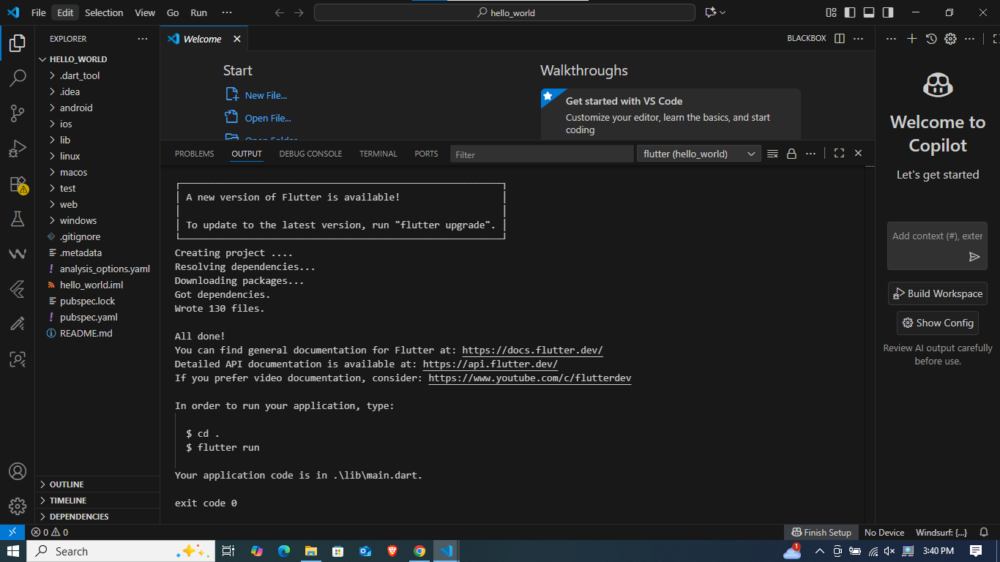
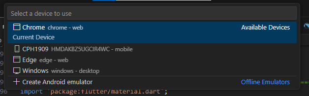

# Codelab 05

  * **Nama:** Rafi Ody Prasetyo
  * **NIM:** 2341720180
  * **Kelas:** TI-3F
  * **Absen:** 24

-----

# Praktikum 1: Membuat Project Flutter Baru

  Setelah dilakukan pembuatan project baru, pada terminal akan muncul pesan `All done!` yang menjadi konfirmasi utama bahwa proyek Flutter berhasil dibuat dan semua paket yang dibutuhkan telah terpasang. Secara bersamaan, seluruh struktur folder dan file proyek baru juga akan tampil di bagian sebelah kiri.

  
  

-----

# Praktikum 2: Menghubungkan Perangkat Android atau Emulator

  Setelah mengaktifkan mode developer di Android dan menyambungkannya via USB atau WiFi, kita dapat memeriksa langsung di Visual Studio Code untuk memastikan perangkat sudah terhubung.

  

  **Running project pada perangkat android:**
