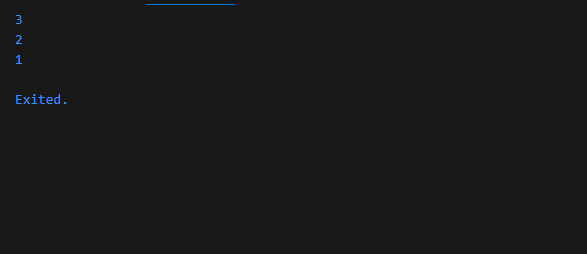
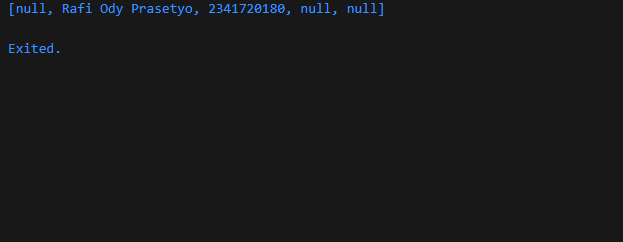
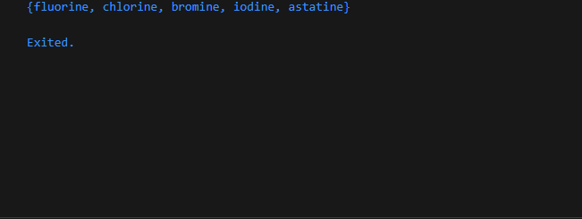
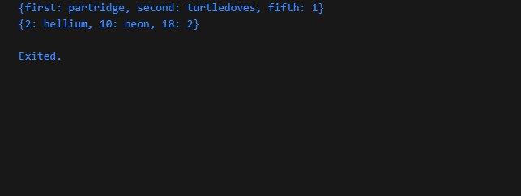
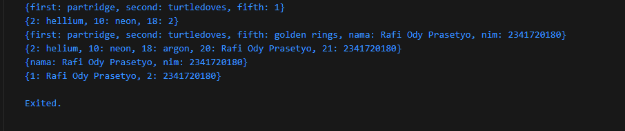
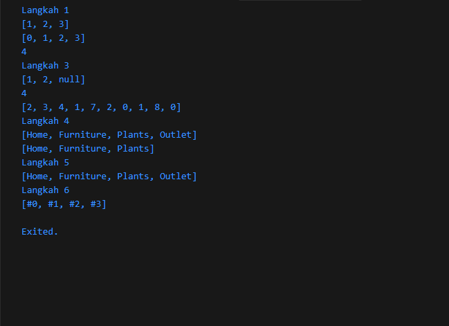

# Codelab 04

  * **Nama:** Rafi Ody Prasetyo
  * **NIM:** 2341720180
  * **Kelas:** TI-3F
  * **Absen:** 24

-----

# Praktikum 1 - Eksperimen Tipe Data List

  ***Langkah 1:*** Ketik/salin kode berikut pada `main()`

  ```dart
  var list = [1, 2, 3];
  assert(list.length == 3);
  assert(list[1] == 2);
  print(list.length);
  print(list[1]);
  
  list[1] = 1;
  assert(list[1] == 1);
  print(list[1]);
  ```

  ***Langkah 2:*** Kemudian eksekusi kode tersebut.

  **Output:**

  
  

  ***Penjelasan:*** Program tersebut membuat list [1, 2, 3], lalu menampilkan panjang list yaitu 3 dan nilai pada index ke-1 yaitu 2. Setelah itu, nilai pada index ke-1 diubah dari 2 menjadi 1, sehingga ketika ditampilkan lagi hasilnya 1.

  ***Langkah 3:*** Ubah kode pada langkah 1 menjadi variabel final yang mempunyai index = 5 dengan default value = null. Isilah nama dan NIM Anda pada elemen index ke-1 dan ke-2. Lalu print dan capture hasilnya.

  ```dart
  final List<String?> list = List.filled(5, null, growable: false);

  list[1] = "Rafi Ody Prasetyo";
  list[2] = "2341720180";

  print(list);
  ```

  **Output:**

  
  

  ***Penjelasan:*** Kode tersebut membuat sebuah list bertipe String? dengan panjang tetap 5 elemen yang awalnya semuanya bernilai null. Karena menggunakan final, list tidak bisa diganti dengan list lain, tetapi isi elemennya tetap bisa diubah. Pada baris berikutnya, elemen indeks ke-1 diisi dengan string "Rafi Ody Prasetyo" dan indeks ke-2 diisi dengan string "2341720180". Saat dicetak, list menampilkan `[null, Rafi Ody Prasetyo, 2341720180, null, null]`.

-----

# Praktikum 2 - Eksperimen Tipe Data Set

  ***Langkah 1:*** Ketik/salin kode berikut pada `main()`

  ```dart
  var halogens = {'fluorine', 'chlorine', 'bromine', 'iodine', 'astatine'};
  print(halogens);
  ```

  ***Langkah 2:*** Kemudian eksekusi kode tersebut.

  **Output:**

  
  

  ***Penjelasan:*** Kode tersebut membuat sebuah Set String berisi nama-nama unsur halogen. Saat dicetak, akan menampilkan semua elemen unik dalam tanda {}, dengan urutan yang tidak harus sama seperti saat didefinisikan.
  
  ***Langkah 3:*** Tambahkan kode program berikut, lalu coba eksekusi (Run) kode Anda.

  ```dart
  var names1 = <String>{};
  Set<String> names2 = {}; // This works, too.
  var names3 = {}; // Creates a map, not a set.

  print(names1);
  print(names2);
  print(names3);
  ```

  **Output:**

  
  .png)

  ***Penjelasan:*** Menampilkan 2 set kosong dari set names1 dan names2, lalu menampilkan map kosong dari map names3.

  Apa yang terjadi ? Jika terjadi error, silakan perbaiki namun tetap menggunakan ketiga variabel tersebut. Tambahkan elemen nama dan NIM Anda pada kedua variabel Set tersebut dengan dua fungsi berbeda yaitu `.add()` dan `.addAll()`. Untuk variabel Map dihapus, nanti kita coba di praktikum selanjutnya.

  ```dart
  names1.add("Rafi Ody Prasetyo");
  names2.addAll({"Rafi Ody Prasetyo", "2341720180"});

  print(names1);
  print(names2);
  ```
  **Output:**


  .png)

-----

# Praktikum 3 - Eksperimen Tipe Data Maps

  ***Langkah 1:*** Ketik/salin kode berikut pada `main()`

  ```dart
  var gifts = {
    // Key:    Value
    'first': 'partridge',
    'second': 'turtledoves',
    'fifth': 1
  };
  
  var nobleGases = {
    2: 'helium',
    10: 'neon',
    18: 2,
  };
  
  print(gifts);
  print(nobleGases);
  ```

  ***Langkah 2:*** Kemudian eksekusi kode tersebut.

  **Output:**

  
  

  ***Penjelasan:*** Kode tersebut membuat dua Map di Dart. Map gifts menggunakan String sebagai key ('first', 'second', 'fifth') dengan value berupa string dan angka, sehingga outputnya {first: partridge, second: turtledoves, fifth: 1}. Sedangkan nobleGases menggunakan int sebagai key (2, 10, 18) dengan value string dan angka, sehingga hasil cetaknya {2: helium, 10: neon, 18: 2}.
  
  ***Langkah 3:*** Tambahkan kode program berikut, lalu coba eksekusi (Run) kode Anda.

  ```dart
  var mhs1 = Map<String, String>();
  gifts['first'] = 'partridge';
  gifts['second'] = 'turtledoves';
  gifts['fifth'] = 'golden rings';

  var mhs2 = Map<int, String>();
  nobleGases[2] = 'helium';
  nobleGases[10] = 'neon';
  nobleGases[18] = 'argon';
  ```
  
  Tambahkan elemen nama dan NIM Anda pada tiap variabel di atas (gifts, nobleGases, mhs1, dan mhs2).

  ```dart
   gifts['nama'] = 'Rafi Ody Prasetyo';
  gifts['nim'] = '2341720180';

  nobleGases[20] = 'Rafi Ody Prasetyo';
  nobleGases[21] = '2341720180';

  mhs1['nama'] = 'Rafi Ody Prasetyo';
  mhs1['nim'] = '2341720180';

  mhs2[1] = 'Rafi Ody Prasetyo';
  mhs2[2] = '2341720180';

  print(gifts);
  print(nobleGases);
  print(mhs1);
  print(mhs2);
  ```

  **Output:**

  
  

  ***Penjelasan:*** Kode tersebut menghasilkan empat output Map berbeda. Map gifts berisi pasangan key–value dengan key berupa string, awalnya menyimpan daftar hadiah lalu ditambah data mahasiswa sehingga hasil akhirnya {first: partridge, second: turtledoves, fifth: golden rings, nama: Rafi Ody Prasetyo, nim: 2341720180}. Map nobleGases menggunakan key bertipe angka, awalnya menyimpan unsur kimia lalu ditambah data mahasiswa sehingga hasilnya {2: helium, 10: neon, 18: argon, 20: Rafi Ody Prasetyo, 21: 2341720180}. Sementara itu, Map mhs1 hanya menyimpan identitas mahasiswa dengan key string, yaitu {nama: Rafi Ody Prasetyo, nim: 2341720180}, dan Map mhs2 menyimpan identitas mahasiswa dengan key angka, yaitu {1: Rafi Ody Prasetyo, 2: 2341720180}.

-----

# Praktikum 4 - Eksperimen Tipe Data List: Spread dan Control-flow Operators

  ***Langkah 1:*** Ketik/salin kode berikut pada `main()`

  ```dart
  print('Langkah 1');
  var list = [1, 2, 3];
  var list2 = [0, ...list];
  print(list);
  print(list2);
  print(list2.length);

  // Langkah 3
  print('Langkah 3');
  List<int?> list1 = [1, 2, null];
  print(list1);
  var list3 = [0, ...?list1];
  print(list3.length);

  var nim = [2, 3, 4, 1, 7, 2, 0, 1, 8, 0];
  var listNim = [...nim];
  print(listNim);

  // Langkah 4
  print('Langkah 4');
  bool promoActive = true;
  var nav_true = ['Home', 'Furniture', 'Plants', if (promoActive) 'Outlet'];
  print(nav_true);

  promoActive = false;
  var nav_false = ['Home', 'Furniture', 'Plants', if (promoActive) 'Outlet'];
  print(nav_false);

  // Langkah 5
  print('Langkah 5');
  String login = 'Manager';
  var nav2 = [
    'Home',
    'Furniture',
    'Plants',
    if (login case 'Manager') 'Outlet',
  ];
  print(nav2);

  // Langkah 6:
  print('Langkah 6');
  var listOfInts = [1, 2, 3];
  var listOfStrings = ['#0', for (var i in listOfInts) '#$i'];
  assert(listOfStrings[1] == '#1');
  print(listOfStrings);
  ```

  ***Langkah 2:*** Kemudian eksekusi kode tersebut.

  **Output:**

  
  

  ***Ringkasan:*** Kode tersebut mendemonstrasikan berbagai fitur manipulasi List di Dart. Pada Langkah 1, dibuat list sederhana `[1, 2, 3]` kemudian digabung dengan operator spread `...` menjadi `[0, 1, 2, 3]` dengan panjang 4. Pada Langkah 3, list dengan elemen nullable `[1, 2, null]` digabung menggunakan `...?` sehingga nilai null diabaikan, menghasilkan panjang 4 pada list baru. Kemudian dibuat list nim yang disalin penuh ke list lain dengan spread operator. Pada Langkah 4, digunakan `if` di dalam list untuk menambahkan elemen secara kondisional: jika promoActive bernilai true, elemen "Outlet" ikut dimasukkan, jika false tidak dimasukkan. Pada Langkah 5, digunakan pola `if (login case 'Manager')` sehingga jika variabel login berisi "Manager", maka "Outlet" otomatis ditambahkan ke list. Terakhir pada Langkah 6, ditunjukkan penggunaan for di dalam list untuk membuat list baru dengan format string #i dari angka dalam `listOfInts`, menghasilkan `['#0', '#1', '#2', '#3']`. Secara keseluruhan, kode ini menjelaskan cara kerja spread operator, null-aware spread, list comprehension, dan list conditionals di Dart.

