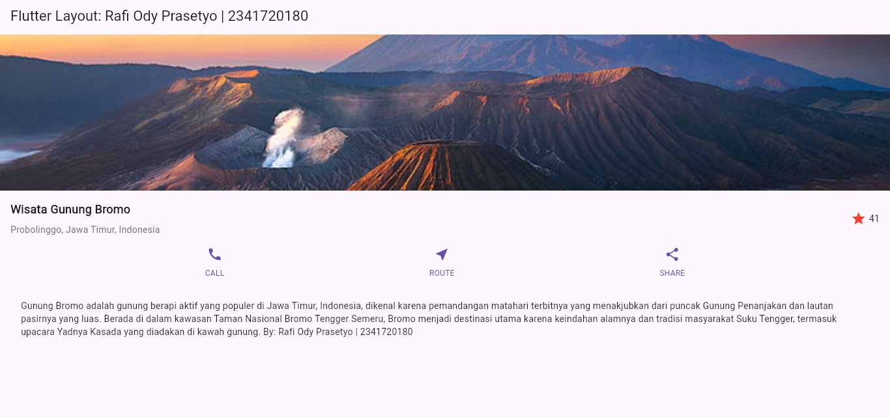
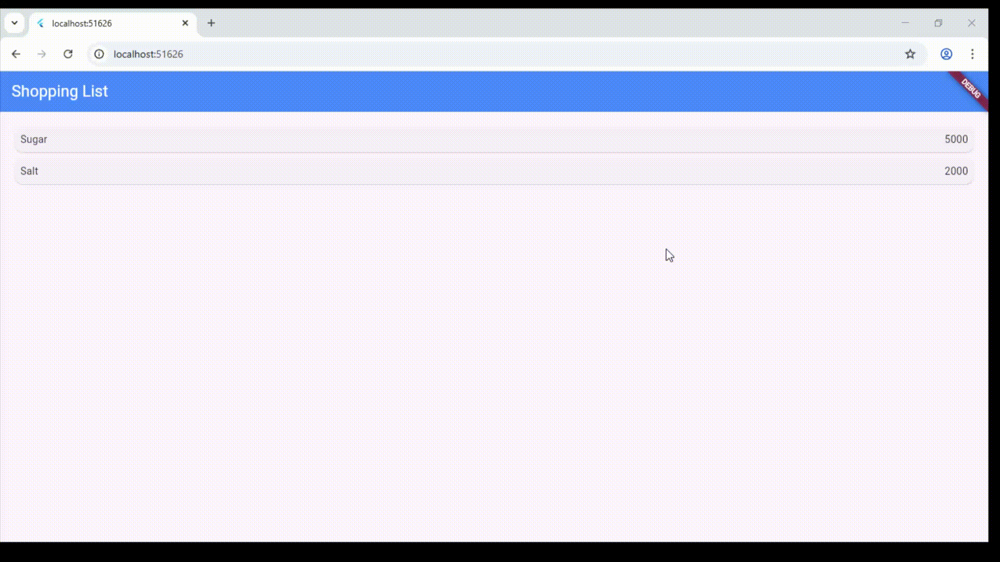
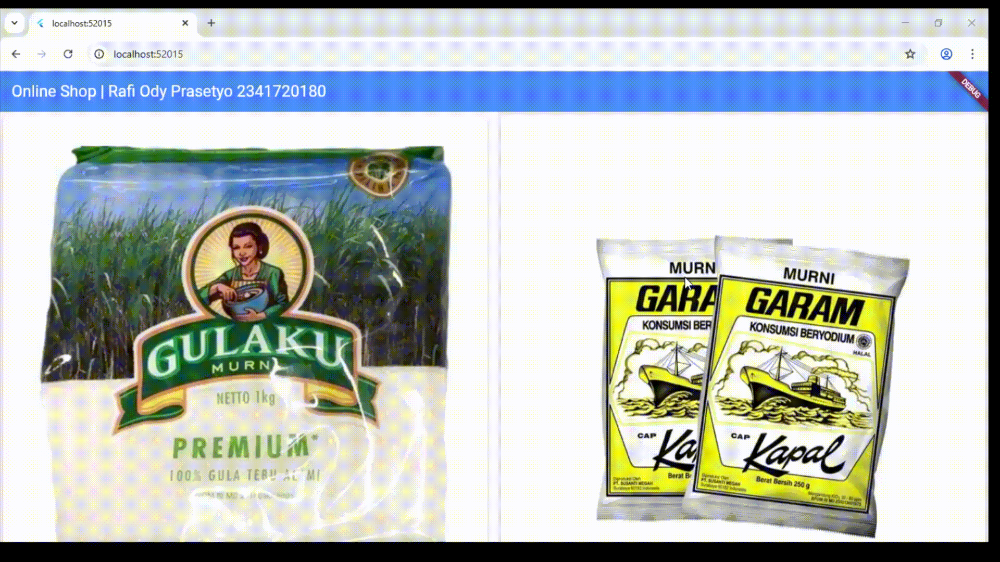

# Codelab 06

  * **Nama:** Rafi Ody Prasetyo
  * **NIM:** 2341720180
  * **Kelas:** TI-3F
  * **Absen:** 24

-----

# Praktikum 1 - 4

  

  
Secara keseluruhan, praktikum ini membangun sebuah layout halaman detail yang komprehensif dengan menggabungkan empat bagian utama menjadi satu kesatuan yang fungsional dan estetis. 
Proses diawali dengan implementasi image section sebagai elemen visual utama atau hero element, yang biasanya menggunakan widget Image dari asset lokal dan diatur dengan properti BoxFit.cover agar gambar dapat mengisi seluruh lebar layar secara proporsional. 
Setelah fondasi visual terbentuk, dilanjutkan dengan implementasi title row yang lebih kompleks, di mana sebuah Row digunakan untuk menampung informasi kunci. 
Di sisi kiri baris ini, sebuah Column menyusun judul utama yang dicetak tebal dan subjudul lokasi dengan warna abu-abu, sementara di sisi kanan terdapat ikon bintang beserta angka ratingnya; untuk memastikan tata letak ini rapi, Column berisi teks tersebut dibungkus dengan widget Expanded agar mendorong bagian rating ke tepi kanan. 
Selanjutnya, untuk menambahkan aspek interaktif, diimplementasikan implementasi button row yang juga menggunakan Row dengan MainAxisAlignment.spaceEvenly untuk mendistribusikan beberapa tombol secara merata. 
Setiap tombol individualnya dibangun dari sebuah Column yang berisi Icon berwarna dan Text label di bawahnya, menciptakan unit aksi yang jelas bagi pengguna seperti 'CALL', 'ROUTE', dan 'SHARE'. 
Sebagai penutup, untuk menyajikan deskripsi yang lebih panjang, ditambahkan implementasi text section yang menggunakan widget Text dengan properti softWrap diatur ke true agar paragraf dapat mengalir ke baris baru secara otomatis tanpa meluber. 
Bagian ini juga diberi Padding yang cukup untuk memberikan ruang dan meningkatkan keterbacaan, sehingga melengkapi seluruh komponen menjadi sebuah halaman detail yang informatif dan profesional.

-----

# Tugas Praktikum 1

  

-----

# Praktikum 5

  

  Untuk menampilkan daftar data yang panjang, developer akan menggunakan widget ListView.builder. 
  Berbeda dari ListView biasa, ListView.builder sangat optimal karena memanfaatkan properti itemBuilder, yaitu sebuah fungsi yang hanya akan membangun atau merender item-item yang terlihat di layar (lazy loading). 
  Saat pengguna menggulir daftar, itemBuilder secara dinamis membuat widget untuk item berikutnya, sehingga aplikasi tetap ringan dan responsif. 
  Kemudian, ketika pengguna mengetuk salah satu item yang telah dibuat oleh itemBuilder, sistem Navigasi akan digunakan untuk berpindah ke halaman detail item tersebut. 
  Proses ini umumnya dilakukan dengan memanggil Navigator.push(), yang akan menempatkan halaman baru di atas tumpukan layar. 
  Untuk kembali ke daftar, pengguna akan memicu Navigator.pop(), yang akan menghapus halaman detail dari tumpukan dan menampilkan kembali halaman daftar ListView sebelumnya.

-----

# Tugas 2

  

  Tugas Praktikum 2 ini berfokus pada penyempurnaan aplikasi "belanja" dengan mengimplementasikan beberapa fitur lanjutan. 
  Mahasiswa diinstruksikan untuk menangani pengiriman data antar halaman secara lengkap, yaitu dengan mengirimkan argumen melalui Navigator.pushNamed dan menerimanya di halaman tujuan menggunakan ModalRoute. 
  Sejalan dengan itu, mahasiswa juga harus menambahkan atribut baru pada data produk (foto, stok, dan rating) serta mengubah tata letak visualnya menjadi GridView agar menyerupai marketplace. 
  Sebagai sentuhan akhir untuk meningkatkan pengalaman pengguna, tugas ini juga mewajibkan implementasi Hero widget untuk menciptakan animasi transisi yang mulus saat berpindah halaman.
