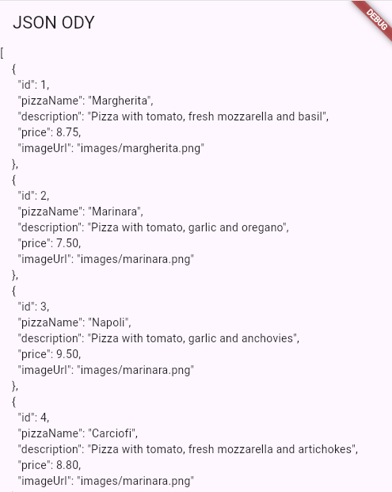
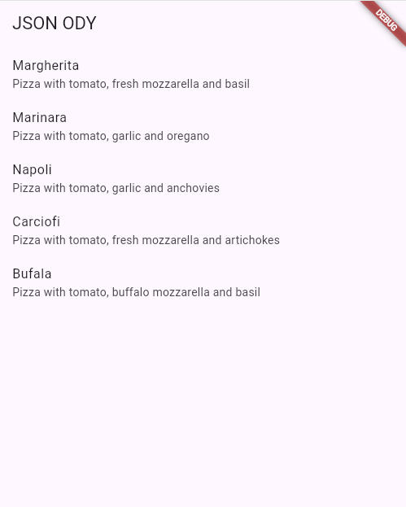
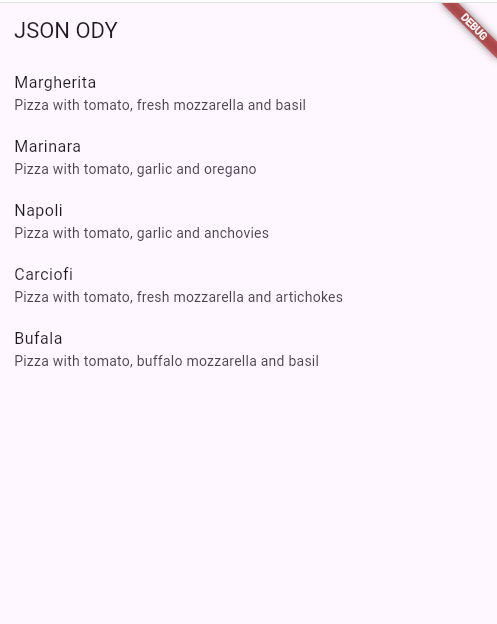
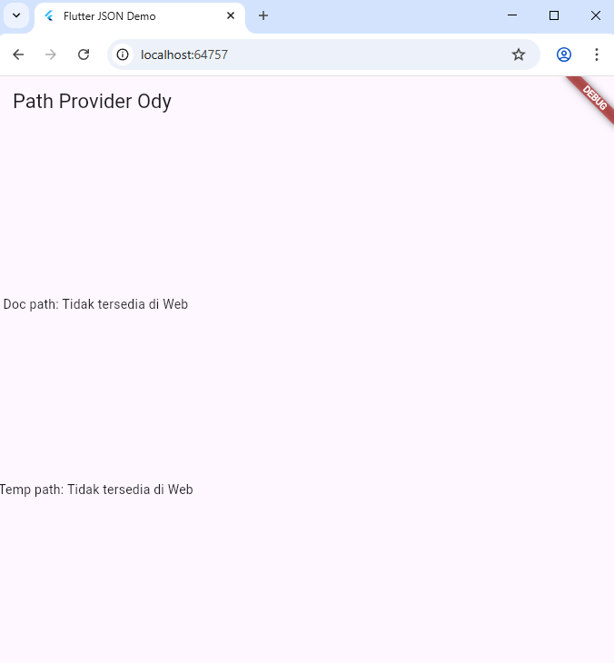
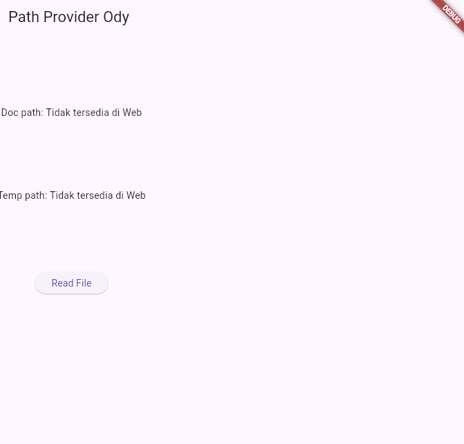
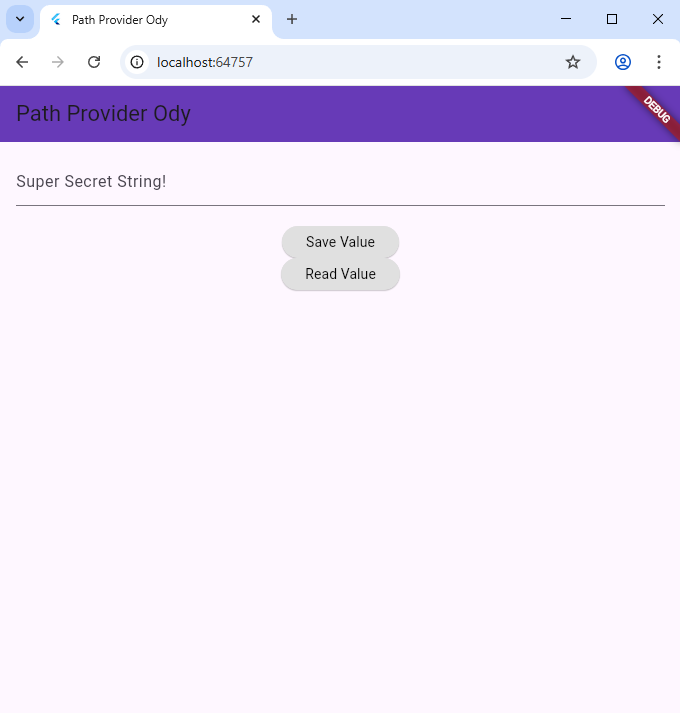

# Praktikum 13 - Persistensi Data

## Informasi Praktikum
- **Nama**: Rafi Ody Prasetyo
- **NIM**: 2341720180
- **Kelas**: TI-3F

---

## Praktikum 1: Konversi Dart Model ke JSON

### Tujuan
Mengonversi data JSON menjadi objek Dart dan sebaliknya (serialization & deserialization).

### Langkah-langkah

#### 1. Buat Project Baru
```bash
flutter create store_data_rizqi
cd store_data_rizqi
```

#### 2. Buat folder `assets` dan file `pizzalist.json`

**File: `assets/pizzalist.json`**
```json
[ 
    { 
      "id": 1, 
      "pizzaName": "Margherita", 
      "description": "Pizza with tomato, fresh mozzarella and basil",
      "price": 8.75, 
      "imageUrl": "images/margherita.png" 
    }, 
    { 
      "id": 2, 
      "pizzaName": "Marinara", 
      "description": "Pizza with tomato, garlic and oregano",
      "price": 7.50, 
      "imageUrl": "images/marinara.png"  
    }, 
    { 
      "id": 3, 
      "pizzaName": "Napoli", 
      "description": "Pizza with tomato, garlic and anchovies",
      "price": 9.50, 
      "imageUrl": "images/marinara.png"  
    }, 
    { 
      "id": 4, 
      "pizzaName": "Carciofi", 
      "description": "Pizza with tomato, fresh mozzarella and artichokes",
      "price": 8.80, 
      "imageUrl": "images/marinara.png"  
    }, 
    { 
      "id": 5, 
      "pizzaName": "Bufala", 
      "description": "Pizza with tomato, buffalo mozzarella and basil",
      "price": 12.50, 
      "imageUrl": "images/marinara.png"  
    }
]
```

#### 3. Edit `pubspec.yaml`

**File: `pubspec.yaml`**
```yaml
flutter:
  uses-material-design: true
  
  # Tambahkan baris berikut untuk menambahkan assets
  assets:
    - assets/pizzalist.json
```

#### 4. Buat Model Pizza

**File: `lib/models/pizza.dart`**
```dart
class Pizza {
  int id;
  String pizzaName;
  String description;
  double price;
  String imageUrl;

  Pizza({
    required this.id,
    required this.pizzaName,
    required this.description,
    required this.price,
    required this.imageUrl,
  });

  // Constructor fromJson untuk deserialization
  Pizza.fromJson(Map<String, dynamic> json)
      : id = json['id'],
        pizzaName = json['pizzaName'],
        description = json['description'],
        price = json['price'],
        imageUrl = json['imageUrl'];

  // Method toJson untuk serialization
  Map<String, dynamic> toJson() {
    return {
      'id': id,
      'pizzaName': pizzaName,
      'description': description,
      'price': price,
      'imageUrl': imageUrl,
    };
  }
}
```

#### 5. Edit Main.dart

**File: `lib/main.dart`**
```dart
import 'package:flutter/material.dart';
import 'package:flutter/services.dart';
import 'dart:convert';
import 'models/pizza.dart';

void main() {
  runApp(const MyApp());
}

class MyApp extends StatelessWidget {
  const MyApp({super.key});

  @override
  Widget build(BuildContext context) {
    return MaterialApp(
      title: 'Flutter Demo [Nama Anda]', // Ganti dengan nama Anda
      theme: ThemeData(
        colorScheme: ColorScheme.fromSeed(seedColor: Colors.deepPurple), // Ganti warna sesuai selera
        useMaterial3: true,
      ),
      home: const MyHomePage(title: 'Flutter Demo Home Page'),
    );
  }
}

class MyHomePage extends StatefulWidget {
  const MyHomePage({super.key, required this.title});
  final String title;

  @override
  State<MyHomePage> createState() => _MyHomePageState();
}

class _MyHomePageState extends State<MyHomePage> {
  List<Pizza> myPizzas = [];

  @override
  void initState() {
    super.initState();
    readJsonFile().then((value) {
      setState(() {
        myPizzas = value;
      });
    });
  }

  Future<List<Pizza>> readJsonFile() async {
    final String myString = await rootBundle.loadString('assets/pizzalist.json');
    List pizzaMapList = jsonDecode(myString);
    
    List<Pizza> myPizzas = [];
    for (var pizza in pizzaMapList) {
      Pizza myPizza = Pizza.fromJson(pizza);
      myPizzas.add(myPizza);
    }
    
    // Konversi kembali ke JSON untuk testing
    String json = convertToJSON(myPizzas);
    print(json);
    
    return myPizzas;
  }

  String convertToJSON(List<Pizza> pizzas) {
    return jsonEncode(pizzas.map((pizza) => pizza.toJson()).toList());
  }

  @override
  Widget build(BuildContext context) {
    return Scaffold(
      appBar: AppBar(
        backgroundColor: Theme.of(context).colorScheme.inversePrimary,
        title: Text(widget.title),
      ),
      body: ListView.builder(
        itemCount: myPizzas.length,
        itemBuilder: (context, index) {
          return ListTile(
            title: Text(myPizzas[index].pizzaName),
            subtitle: Text(myPizzas[index].description),
          );
        },
      ),
    );
  }
}
```

### Soal 1
✅ Nama panggilan ditambahkan pada `title` app
✅ Warna tema aplikasi disesuaikan

### Soal 2
Screenshot aplikasi menampilkan list pizza:




### Soal 3
Screenshot aplikasi menampilkan list pizza dengan struktur lebih baik:




---

## Praktikum 2: Handle Kompatibilitas Data JSON

### Tujuan
Menangani data JSON yang tidak konsisten atau "rusak" dengan menggunakan type casting dan null handling yang aman.

### File yang Dimodifikasi

**File: `lib/models/pizza.dart`** (FINAL)
```dart
class Pizza {
  int id;
  String pizzaName;
  String description;
  double price;
  String imageUrl;

  Pizza({
    required this.id,
    required this.pizzaName,
    required this.description,
    required this.price,
    required this.imageUrl,
  });

  // Constructor fromJson dengan error handling
  Pizza.fromJson(Map<String, dynamic> json)
      : id = int.tryParse(json['id'].toString()) ?? 0,
        pizzaName = json['pizzaName']?.toString() ?? '',
        description = json['description']?.toString() ?? '',
        price = double.tryParse(json['price'].toString()) ?? 0.0,
        imageUrl = json['imageUrl']?.toString() ?? '';

  // Method toJson untuk serialization
  Map<String, dynamic> toJson() {
    return {
      'id': id,
      'pizzaName': pizzaName,
      'description': description,
      'price': price,
      'imageUrl': imageUrl,
    };
  }
}
```

**File: `lib/main.dart`** (Update bagian ListView.builder)
```dart
body: ListView.builder(
  itemCount: myPizzas.length,
  itemBuilder: (context, index) {
    return ListTile(
      title: Text(myPizzas[index].pizzaName.isNotEmpty 
          ? myPizzas[index].pizzaName 
          : 'No name'),
      subtitle: Text(myPizzas[index].description.isNotEmpty 
          ? myPizzas[index].description 
          : 'No description'),
    );
  },
),
```

### Penjelasan Perbaikan
- **`int.tryParse()`**: Mengkonversi String ke int dengan aman, return null jika gagal
- **`double.tryParse()`**: Mengkonversi String ke double dengan aman
- **`??` (null coalescing)**: Memberikan nilai default jika nilai null
- **`.toString()`**: Memastikan nilai selalu String
- **Operator ternary**: Menampilkan teks user-friendly jika data kosong

### Soal 4
Screenshot aplikasi menangani data yang tidak konsisten:


---

## Praktikum 3: Menangani Error JSON

### Tujuan
Menggunakan konstanta untuk mengganti string literals agar menghindari typo dan membuat kode lebih maintainable.

### File yang Dimodifikasi

**File: `lib/models/pizza.dart`** (FINAL dengan Konstanta)
```dart
// Konstanta untuk kunci JSON
const String keyId = 'id';
const String keyPizzaName = 'pizzaName';
const String keyDescription = 'description';
const String keyPrice = 'price';
const String keyImageUrl = 'imageUrl';

class Pizza {
  int id;
  String pizzaName;
  String description;
  double price;
  String imageUrl;

  Pizza({
    required this.id,
    required this.pizzaName,
    required this.description,
    required this.price,
    required this.imageUrl,
  });

  // Constructor fromJson menggunakan konstanta
  Pizza.fromJson(Map<String, dynamic> json)
      : id = int.tryParse(json[keyId].toString()) ?? 0,
        pizzaName = json[keyPizzaName]?.toString() ?? '',
        description = json[keyDescription]?.toString() ?? '',
        price = double.tryParse(json[keyPrice].toString()) ?? 0.0,
        imageUrl = json[keyImageUrl]?.toString() ?? '';

  // Method toJson menggunakan konstanta
  Map<String, dynamic> toJson() {
    return {
      keyId: id,
      keyPizzaName: pizzaName,
      keyDescription: description,
      keyPrice: price,
      keyImageUrl: imageUrl,
    };
  }
}
```

### Soal 5
**Penjelasan "lebih safe dan maintainable":**

Menggunakan konstanta untuk kunci JSON membuat kode lebih aman dan mudah dirawat karena:

1. **Mencegah Typo**: Jika ada kesalahan ketik pada nama kunci, akan terdeteksi saat compile time (error langsung), bukan saat runtime.

2. **Mudah Refactor**: Jika nama kunci JSON berubah, cukup ubah di satu tempat (definisi konstanta), tidak perlu mencari di semua file.

3. **Autocomplete**: IDE akan memberikan saran autocomplete sehingga mengurangi kesalahan pengetikan.

4. **Single Source of Truth**: Semua referensi ke kunci JSON menggunakan konstanta yang sama, menghindari inkonsistensi.

---

## Praktikum 4: SharedPreferences

### Tujuan
Menyimpan data sederhana (seperti counter) menggunakan SharedPreferences.

### Langkah-langkah

#### 1. Tambahkan Dependensi
```bash
flutter pub add shared_preferences
```

#### 2. File Main.dart (FINAL untuk Praktikum 4)

**File: `lib/main.dart`**
```dart
import 'package:flutter/material.dart';
import 'package:flutter/services.dart';
import 'dart:convert';
import 'models/pizza.dart';
import 'package:shared_preferences/shared_preferences.dart';

void main() {
  runApp(const MyApp());
}

class MyApp extends StatelessWidget {
  const MyApp({super.key});

  @override
  Widget build(BuildContext context) {
    return MaterialApp(
      title: 'Flutter Demo [Nama Anda]',
      theme: ThemeData(
        colorScheme: ColorScheme.fromSeed(seedColor: Colors.deepPurple),
        useMaterial3: true,
      ),
      home: const MyHomePage(title: 'Flutter Demo Home Page'),
    );
  }
}

class MyHomePage extends StatefulWidget {
  const MyHomePage({super.key, required this.title});
  final String title;

  @override
  State<MyHomePage> createState() => _MyHomePageState();
}

class _MyHomePageState extends State<MyHomePage> {
  List<Pizza> myPizzas = [];
  int appCounter = 0;

  @override
  void initState() {
    super.initState();
    readJsonFile().then((value) {
      setState(() {
        myPizzas = value;
      });
    });
    readAndWritePreference();
  }

  Future<List<Pizza>> readJsonFile() async {
    final String myString = await rootBundle.loadString('assets/pizzalist.json');
    List pizzaMapList = jsonDecode(myString);
    
    List<Pizza> myPizzas = [];
    for (var pizza in pizzaMapList) {
      Pizza myPizza = Pizza.fromJson(pizza);
      myPizzas.add(myPizza);
    }
    
    String json = convertToJSON(myPizzas);
    print(json);
    
    return myPizzas;
  }

  String convertToJSON(List<Pizza> pizzas) {
    return jsonEncode(pizzas.map((pizza) => pizza.toJson()).toList());
  }

  Future<void> readAndWritePreference() async {
    SharedPreferences prefs = await SharedPreferences.getInstance();
    appCounter = prefs.getInt('appCounter') ?? 0;
    appCounter++;
    await prefs.setInt('appCounter', appCounter);
    setState(() {
      appCounter = appCounter;
    });
  }

  Future<void> deletePreference() async {
    SharedPreferences prefs = await SharedPreferences.getInstance();
    await prefs.clear();
    setState(() {
      appCounter = 0;
    });
  }

  @override
  Widget build(BuildContext context) {
    return Scaffold(
      appBar: AppBar(
        backgroundColor: Theme.of(context).colorScheme.inversePrimary,
        title: Text(widget.title),
      ),
      body: Center(
        child: Column(
          mainAxisAlignment: MainAxisAlignment.center,
          children: [
            Text(
              'You have opened the app $appCounter times',
              style: const TextStyle(fontSize: 18),
            ),
            const SizedBox(height: 20),
            ElevatedButton(
              onPressed: () {
                deletePreference();
              },
              child: const Text('Reset counter'),
            ),
          ],
        ),
      ),
    );
  }
}
```

### Soal 6
Screenshot/GIF aplikasi dengan counter SharedPreferences:


---

## Praktikum 5: Akses Filesystem dengan path_provider

### Tujuan
Mengakses direktori aplikasi menggunakan package `path_provider`.

### Langkah-langkah

#### 1. Tambahkan Dependensi
```bash
flutter pub add path_provider
```

#### 2. File Main.dart (FINAL untuk Praktikum 5)

**File: `lib/main.dart`**
```dart
import 'package:flutter/material.dart';
import 'package:flutter/services.dart';
import 'dart:convert';
import 'models/pizza.dart';
import 'package:shared_preferences/shared_preferences.dart';
import 'package:path_provider/path_provider.dart';

void main() {
  runApp(const MyApp());
}

class MyApp extends StatelessWidget {
  const MyApp({super.key});

  @override
  Widget build(BuildContext context) {
    return MaterialApp(
      title: 'Flutter Demo [Nama Anda]',
      theme: ThemeData(
        colorScheme: ColorScheme.fromSeed(seedColor: Colors.deepPurple),
        useMaterial3: true,
      ),
      home: const MyHomePage(title: 'Flutter Demo Home Page'),
    );
  }
}

class MyHomePage extends StatefulWidget {
  const MyHomePage({super.key, required this.title});
  final String title;

  @override
  State<MyHomePage> createState() => _MyHomePageState();
}

class _MyHomePageState extends State<MyHomePage> {
  List<Pizza> myPizzas = [];
  int appCounter = 0;
  String documentsPath = '';
  String tempPath = '';

  @override
  void initState() {
    super.initState();
    getPaths();
  }

  Future<void> getPaths() async {
    final docDir = await getApplicationDocumentsDirectory();
    final tempDir = await getTemporaryDirectory();
    setState(() {
      documentsPath = docDir.path;
      tempPath = tempDir.path;
    });
  }

  @override
  Widget build(BuildContext context) {
    return Scaffold(
      appBar: AppBar(
        backgroundColor: Theme.of(context).colorScheme.inversePrimary,
        title: Text(widget.title),
      ),
      body: Center(
        child: Padding(
          padding: const EdgeInsets.all(16.0),
          child: Column(
            mainAxisAlignment: MainAxisAlignment.center,
            crossAxisAlignment: CrossAxisAlignment.start,
            children: [
              const Text(
                'Documents Path:',
                style: TextStyle(fontWeight: FontWeight.bold, fontSize: 16),
              ),
              const SizedBox(height: 8),
              Text(
                documentsPath,
                style: const TextStyle(fontSize: 14),
              ),
              const SizedBox(height: 24),
              const Text(
                'Temp Path:',
                style: TextStyle(fontWeight: FontWeight.bold, fontSize: 16),
              ),
              const SizedBox(height: 8),
              Text(
                tempPath,
                style: const TextStyle(fontSize: 14),
              ),
            ],
          ),
        ),
      ),
    );
  }
}
```

### Soal 7
Screenshot aplikasi menampilkan path dokumen dan temp:


---

## Praktikum 6: Akses Filesystem dengan Direktori

### Tujuan
Membaca dan menulis file menggunakan library `dart:io`.

### File Main.dart (FINAL untuk Praktikum 6)

**File: `lib/main.dart`**
```dart
import 'package:flutter/material.dart';
import 'package:flutter/services.dart';
import 'dart:convert';
import 'dart:io';
import 'models/pizza.dart';
import 'package:shared_preferences/shared_preferences.dart';
import 'package:path_provider/path_provider.dart';

void main() {
  runApp(const MyApp());
}

class MyApp extends StatelessWidget {
  const MyApp({super.key});

  @override
  Widget build(BuildContext context) {
    return MaterialApp(
      title: 'Flutter Demo [Nama Anda]',
      theme: ThemeData(
        colorScheme: ColorScheme.fromSeed(seedColor: Colors.deepPurple),
        useMaterial3: true,
      ),
      home: const MyHomePage(title: 'Flutter Demo Home Page'),
    );
  }
}

class MyHomePage extends StatefulWidget {
  const MyHomePage({super.key, required this.title});
  final String title;

  @override
  State<MyHomePage> createState() => _MyHomePageState();
}

class _MyHomePageState extends State<MyHomePage> {
  List<Pizza> myPizzas = [];
  int appCounter = 0;
  String documentsPath = '';
  String tempPath = '';
  late File myFile;
  String fileText = '';

  @override
  void initState() {
    super.initState();
    getPaths().then((_) {
      myFile = File('$documentsPath/pizzas.txt');
      writeFile();
    });
  }

  Future<void> getPaths() async {
    final docDir = await getApplicationDocumentsDirectory();
    final tempDir = await getTemporaryDirectory();
    setState(() {
      documentsPath = docDir.path;
      tempPath = tempDir.path;
    });
  }

  Future<bool> writeFile() async {
    try {
      // Ganti dengan Nama Lengkap dan NIM Anda
      await myFile.writeAsString('Margherita, Capricciosa, Napoli');
      return true;
    } catch (e) {
      return false;
    }
  }

  Future<bool> readFile() async {
    try {
      String fileContent = await myFile.readAsString();
      setState(() {
        fileText = fileContent;
      });
      return true;
    } catch (e) {
      return false;
    }
  }

  @override
  Widget build(BuildContext context) {
    return Scaffold(
      appBar: AppBar(
        backgroundColor: Theme.of(context).colorScheme.inversePrimary,
        title: Text(widget.title),
      ),
      body: Center(
        child: Padding(
          padding: const EdgeInsets.all(16.0),
          child: Column(
            mainAxisAlignment: MainAxisAlignment.center,
            children: [
              const Text(
                'Documents Path:',
                style: TextStyle(fontWeight: FontWeight.bold, fontSize: 16),
              ),
              const SizedBox(height: 8),
              Text(
                documentsPath,
                style: const TextStyle(fontSize: 14),
              ),
              const SizedBox(height: 24),
              const Text(
                'Temp Path:',
                style: TextStyle(fontWeight: FontWeight.bold, fontSize: 16),
              ),
              const SizedBox(height: 8),
              Text(
                tempPath,
                style: const TextStyle(fontSize: 14),
              ),
              const SizedBox(height: 24),
              ElevatedButton(
                onPressed: () {
                  readFile();
                },
                child: const Text('Read File'),
              ),
              const SizedBox(height: 16),
              Text(
                fileText,
                style: const TextStyle(fontSize: 16, fontWeight: FontWeight.bold),
              ),
            ],
          ),
        ),
      ),
    );
  }
}
```

### Soal 8

**Penjelasan Langkah 3 dan 7:**

**Langkah 3 - Method `writeFile()`:**
```dart
Future<bool> writeFile() async {
  try {
    await myFile.writeAsString('Margherita, Capricciosa, Napoli');
    return true;
  } catch (e) {
    return false;
  }
}
```
- Method ini menulis string ke file `pizzas.txt` di direktori dokumen aplikasi
- Menggunakan `try-catch` untuk menangani error jika terjadi masalah saat menulis
- Return `true` jika berhasil, `false` jika gagal
- `await` digunakan karena operasi file bersifat asynchronous

**Langkah 7 - Tombol Read File:**
- Ketika tombol "Read File" ditekan, method `readFile()` dipanggil
- Method tersebut membaca konten file menggunakan `myFile.readAsString()`
- Hasil pembacaan disimpan di variabel `fileText` dan ditampilkan di UI
- Menggunakan `setState()` agar UI ter-update dengan konten yang dibaca

Screenshot/GIF:


---

## Praktikum 7: Menyimpan Data dengan Enkripsi/Dekripsi

### Tujuan
Menyimpan data sensitif (seperti password) dengan aman menggunakan `flutter_secure_storage`.

### Langkah-langkah

#### 1. Tambahkan Dependensi
```bash
flutter pub add flutter_secure_storage
```

#### 2. File Main.dart (FINAL untuk Praktikum 7)

**File: `lib/main.dart`**
```dart
import 'package:flutter/material.dart';
import 'package:flutter/services.dart';
import 'dart:convert';
import 'dart:io';
import 'models/pizza.dart';
import 'package:shared_preferences/shared_preferences.dart';
import 'package:path_provider/path_provider.dart';
import 'package:flutter_secure_storage/flutter_secure_storage.dart';

void main() {
  runApp(const MyApp());
}

class MyApp extends StatelessWidget {
  const MyApp({super.key});

  @override
  Widget build(BuildContext context) {
    return MaterialApp(
      title: 'Flutter Demo [Nama Anda]',
      theme: ThemeData(
        colorScheme: ColorScheme.fromSeed(seedColor: Colors.deepPurple),
        useMaterial3: true,
      ),
      home: const MyHomePage(title: 'Flutter Demo Home Page'),
    );
  }
}

class MyHomePage extends StatefulWidget {
  const MyHomePage({super.key, required this.title});
  final String title;

  @override
  State<MyHomePage> createState() => _MyHomePageState();
}

class _MyHomePageState extends State<MyHomePage> {
  List<Pizza> myPizzas = [];
  int appCounter = 0;
  String documentsPath = '';
  String tempPath = '';
  late File myFile;
  String fileText = '';
  
  // Secure Storage variables
  final pwdController = TextEditingController();
  String myPass = '';
  final storage = const FlutterSecureStorage();
  final myKey = 'myPass';

  @override
  void initState() {
    super.initState();
    getPaths().then((_) {
      myFile = File('$documentsPath/pizzas.txt');
      writeFile();
    });
  }

  Future<void> getPaths() async {
    final docDir = await getApplicationDocumentsDirectory();
    final tempDir = await getTemporaryDirectory();
    setState(() {
      documentsPath = docDir.path;
      tempPath = tempDir.path;
    });
  }

  Future<bool> writeFile() async {
    try {
      await myFile.writeAsString('Margherita, Capricciosa, Napoli');
      return true;
    } catch (e) {
      return false;
    }
  }

  Future<bool> readFile() async {
    try {
      String fileContent = await myFile.readAsString();
      setState(() {
        fileText = fileContent;
      });
      return true;
    } catch (e) {
      return false;
    }
  }

  Future<void> writeToSecureStorage() async {
    await storage.write(key: myKey, value: pwdController.text);
  }

  Future<void> readFromSecureStorage() async {
    String secret = await storage.read(key: myKey) ?? '';
    setState(() {
      myPass = secret;
    });
  }

  @override
  Widget build(BuildContext context) {
    return Scaffold(
      appBar: AppBar(
        backgroundColor: Theme.of(context).colorScheme.inversePrimary,
        title: Text(widget.title),
      ),
      body: SingleChildScrollView(
        child: Padding(
          padding: const EdgeInsets.all(16.0),
          child: Column(
            mainAxisAlignment: MainAxisAlignment.center,
            children: [
              const Text(
                'Documents Path:',
                style: TextStyle(fontWeight: FontWeight.bold, fontSize: 16),
              ),
              const SizedBox(height: 8),
              Text(
                documentsPath,
                style: const TextStyle(fontSize: 14),
              ),
              const SizedBox(height: 24),
              const Text(
                'Temp Path:',
                style: TextStyle(fontWeight: FontWeight.bold, fontSize: 16),
              ),
              const SizedBox(height: 8),
              Text(
                tempPath,
                style: const TextStyle(fontSize: 14),
              ),
              const SizedBox(height: 24),
              ElevatedButton(
                onPressed: () {
                  readFile();
                },
                child: const Text('Read File'),
              ),
              const SizedBox(height: 16),
              Text(
                fileText,
                style: const TextStyle(fontSize: 16, fontWeight: FontWeight.bold),
              ),
              const SizedBox(height: 32),
              const Divider(),
              const SizedBox(height: 16),
              const Text(
                'Secure Storage Demo',
                style: TextStyle(fontWeight: FontWeight.bold, fontSize: 18),
              ),
              const SizedBox(height: 16),
              TextField(
                controller: pwdController,
                decoration: const InputDecoration(
                  border: OutlineInputBorder(),
                  labelText: 'Enter Password',
                ),
              ),
              const SizedBox(height: 16),
              ElevatedButton(
                onPressed: () {
                  writeToSecureStorage();
                },
                child: const Text('Save Value'),
              ),
              const SizedBox(height: 16),
              ElevatedButton(
                onPressed: () {
                  readFromSecureStorage();
                },
                child: const Text('Read Value'),
              ),
              const SizedBox(height: 16),
              Text(
                'Password: $myPass',
                style: const TextStyle(fontSize: 16, fontWeight: FontWeight.bold),
              ),
            ],
          ),
        ),
      ),
    );
  }
}
```

### Soal 9
Screenshot/GIF aplikasi dengan Secure Storage (Save & Read password):


[Masukkan screenshot/GIF di sini]

---
