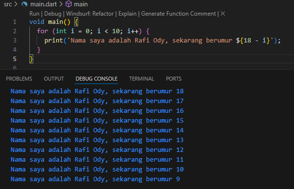
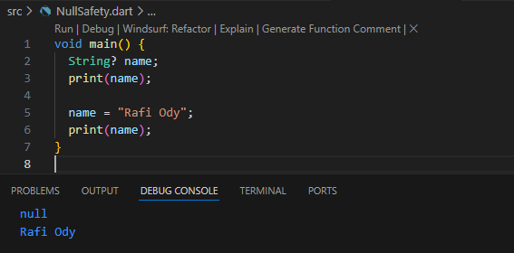
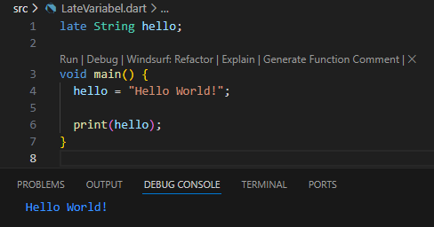

# CODELAB 02

    * **Nama:** Rafi Ody Prasetyo
    * **NIM:** 2341720180
    * **Kelas:** TI-3F
    * **Absen:** 24

---

## Tugas Praktikum

### 1. Modifikasilah kode pada baris 3 di VS Code atau Editor Code favorit Anda berikut ini agar mendapatkan keluaran (output) sesuai yang diminta!

    **Kode awal:**

    ```dart
        void main() {
            for (int i = 0; i < 10; i++) {
              print('hello ${i + 2}');
            }
        }
    ```

    **Output yang diminta (Gantilah Fulan dengan nama Anda):**
    ```
        Nama saya adalah Fulan, sekarang berumur 18
        Nama saya adalah Fulan, sekarang berumur 17
        Nama saya adalah Fulan, sekarang berumur 16
        Nama saya adalah Fulan, sekarang berumur 15
        Nama saya adalah Fulan, sekarang berumur 14
        Nama saya adalah Fulan, sekarang berumur 13
        Nama saya adalah Fulan, sekarang berumur 12
        Nama saya adalah Fulan, sekarang berumur 11
        Nama saya adalah Fulan, sekarang berumur 10
        Nama saya adalah Fulan, sekarang berumur 9
    ```

    **Kode yang telah dimodifikasi:**

    ```dart
        void main() {
            for (int i = 0; i < 10; i++) {
              print('Nama saya adalah Rafi Ody, sekarang berumur ${18 - i}');
            }
        }
    ```

    **Hasil eksekusi:**
    

    Pada program tersebut, perulangan for menggunakan variabel i yang nilainya bertambah (increment) dari 0 sampai 9. Namun, bagian umur dituliskan sebagai ${18 - i}. Karena i terus bertambah, hasil dari 18 - i justru menghasilkan nilai yang semakin kecil (18, 17, 16, ..., 9).

    Dengan cara ini, meskipun variabel perulangan bertambah, nilai umur yang ditampilkan tetap berkurang (decrement) setiap     iterasi. Jadi benar, untuk menghasilkan output umur yang semakin menurun, program menggunakan operasi pengurangan   terhadap variabel i.

---

### 2. Mengapa sangat penting untuk memahami bahasa pemrograman Dart sebelum kita menggunakan framework Flutter ? Jelaskan!

    **Jawaban:**

    Sebelum menggunakan Flutter, penting memahami bahasa Dart karena Flutter dibangun sepenuhnya dengan Dart. Dengan menguasai Dart, kita bisa memahami dasar logika, OOP, serta konsep asynchronous yang menjadi pondasi utama dalam pengembangan aplikasi Flutter.

### 3. Rangkumlah materi dari codelab ini menjadi poin-poin penting yang dapat Anda gunakan untuk membantu proses pengembangan aplikasi mobile menggunakan framework Flutter.

    Dart merupakan bahasa fundamental dari Flutter. Sangat penting untuk menguasai dart sebelum flutter, karena  Flutter dibangun sepenuhnya dengan Dart. Dart dibentuk agar kuat dan fleksibel.  Dengan tetap mempertahankan type annotations bersifat opsional dan menambahkan fitur OOP, Dart dapat menyeimbangkan dua fitur utama yaitu fleksibilitas dan ketangguhan.

    **Dua mode eksekusi dart:**
    **1. Kompilasi JIT (Just-In-Time):** Proses di mana kode Dart dikompilasi ke kode mesin saat aplikasi dijalankan. Teknik ini digunakan pada tahap pengembangan karena mendukung debugging dan hot reload sehingga mempercepat proses coding.

    **2. Kompilasi AOT (Ahead of Time):** Proses mengubah kode Dart menjadi kode mesin sebelum dijalankan, sehingga aplikasi berjalan lebih cepat dan efisien, tetapi tidak mendukung debugging dan hot reload.

### 4. Buatlah penjelasan dan contoh eksekusi kode tentang perbedaan Null Safety dan Late variabel !

    **Jawaban:**

    `Null Safety` adalah fitur pada Dart yang berfungsi untuk mencegah error akibat variabel yang bernilai null. Dengan null safety, kita harus menentukan sejak awal apakah sebuah variabel boleh bernilai null atau tidak. Jika variabel dideklarasikan tanpa tanda tanya (?), maka variabel tersebut wajib memiliki nilai dan tidak boleh kosong. Sebaliknya, jika ditandai dengan ?, variabel tersebut boleh kosong, tetapi saat dipakai harus ditangani terlebih dahulu agar tidak menimbulkan error.
    **Contoh Kode:**

    ```dart
        void main() {
            String? name;
            print(name);

            name = "Rafi Ody";
            print(name);
        }
    ```

    **Output:**
    

    Sementara itu, `Late Variable` adalah cara mendeklarasikan variabel tanpa langsung memberi nilai awal, namun nilainya dipastikan akan diberikan kemudian sebelum digunakan. Kata kunci late biasanya dipakai pada variabel non-nullable yang belum bisa ditentukan nilainya saat deklarasi, tetapi kita yakin nilainya akan tersedia sebelum dipakai. Jika sebuah variabel late dipanggil sebelum diberi nilai, maka akan terjadi error pada runtime.
    **Contoh Kode:**

    ```dart
        late String hello;

        void main() {
          hello = "Hello World!";

          print(hello);
        }
    ```

    **Output:**
    
