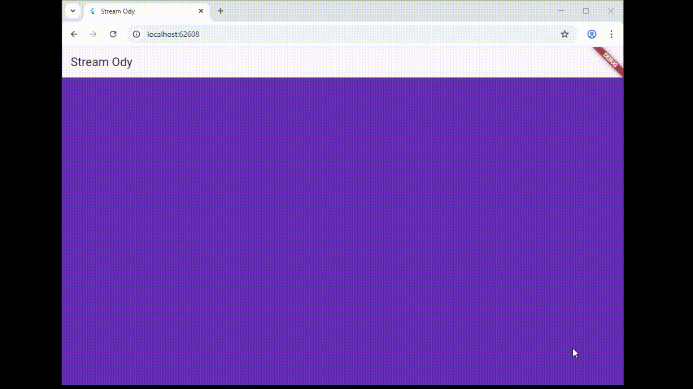
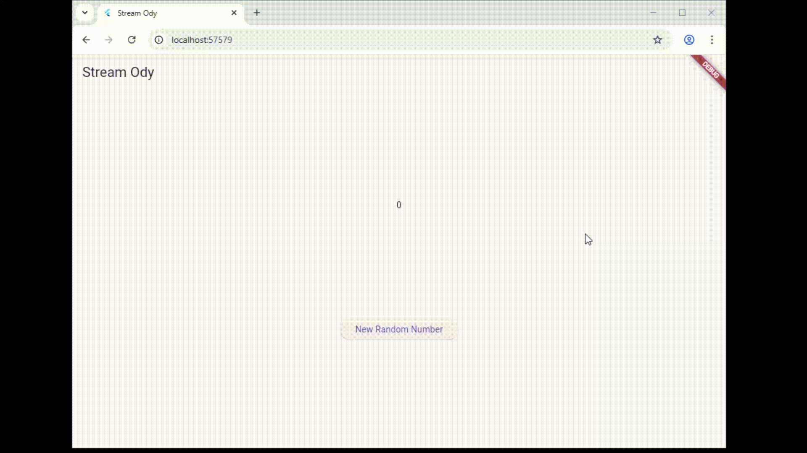
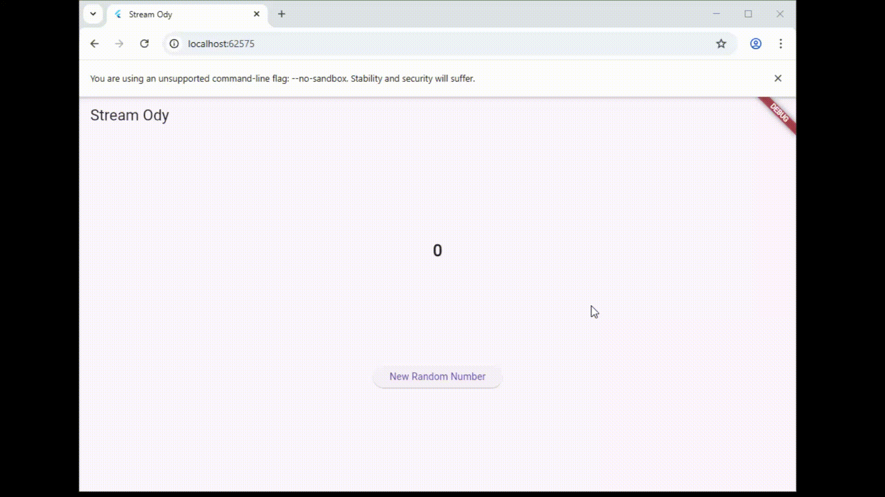

# Codelab 10

  * **Nama:** Rafi Ody Prasetyo
  * **NIM:** 2341720180
  * **Kelas:** TI-3F
  * **Absen:** 24

-----

# Praktikum 1

Di langkah 2 dan 3, terdapat dua file model task.dart dan plan.dart. File-file ini mewakili struktur data (Model) dalam aplikasi. Nantinya, file-file lain akan membutuhkan akses ke kedua kelas (Task dan Plan) tersebut. Tujuannya adalah efisiensi, bayangkan jika punya 10 file model. Daripada menulis 10 baris import di setiap file UI, hanya cukup menulis 1 baris import ke data_layer.dart. Pada langkah 6, variabel plan adalah state (data) yang akan ditampilkan dan dimanipulasi oleh layar PlanScreen. Mengapa Perlu Variabel plan? PlanScreen adalah StatefulWidget, yang berarti tampilannya bisa berubah berdasarkan data internal. Variabel plan (yang bertipe Plan) inilah yang menyimpan data tersebut. Dia menyimpan daftar tugas (List<Task>) yang akan ditampilkan oleh ListView (di Langkah 8) dan juga nama rencananya. Tanpa variabel ini, PlanScreen tidak memiliki data untuk ditampilkan. Kegunaan Method initState() (Langkah 11) dan dispose() (Langkah 13) adalah bagian penting dari State Lifecycle (siklus hidup state) pada StatefulWidget untuk mengelola resource (sumber daya).

-----

# Praktikum 2

Pada langkah 1 yang dimaksud dengan InheritedWidget adalah InheritedNotifier. InheritedNotifier bukanlah sesuatu yang benar-benar terpisah, melainkan sebuah subclass (kelas turunan) yang lebih spesifik dari InheritedWidget. Jadi, semua yang bisa dilakukan InheritedWidget (yaitu meneruskan data ke widget tree di bawahnya), juga bisa dilakukan oleh InheritedNotifier. PlanProvider pada dasarnya adalah sebuah InheritedWidget dengan kemampuan tambahan. Pada langkah 3, kedua baris kode tersebut sebenarnya adalah getter (properti terkomputasi), bukan method yang berfungsi untuk mengolah data mentah di dalam kelas Model. Getter completedCount bertugas menghitung jumlah tugas yang telah selesai dengan memfilter daftar (List) tugas dan hanya menghitung yang properti complete-nya bernilai true. Getter completenessMessage kemudian menggunakan hasil hitungan tersebut untuk membuat sebuah pesan status (String) yang mudah dibaca manusia. 

-----

# Praktikum 3 

Berdasarkan Praktikum 3, diagram tersebut mengilustrasikan bagaimana state management (pengelolaan data) bekerja di antara dua layar yang berbeda menggunakan PlanProvider. Diagram kiri (biru) menunjukkan hierarki widget untuk PlanCreatorScreen (layar untuk membuat rencana), sedangkan diagram kanan (hijau) adalah hierarki untuk PlanScreen (layar utama yang menampilkan daftar rencana). Inti dari gambar ini adalah penempatan PlanProvider di atas kedua hierarki layar tersebut (meskipun hanya digambarkan di sebelah kiri, dalam praktiknya ia membungkus kedua layar). Karena PlanProvider adalah InheritedWidget, ia memungkinkan layar anak (PlanCreatorScreen) yang dibuka melalui "Navigator Push" untuk mengakses dan memodifikasi state (data Plan) yang sama persis dengan yang dimiliki layar induk (PlanScreen). Dengan demikian, ketika PlanCreatorScreen selesai membuat rencana dan ditutup (Navigator.pop), PlanScreen secara otomatis akan diperbarui untuk menampilkan data baru tersebut karena keduanya terhubung ke sumber data (ValueNotifier) yang sama melalui PlanProvider.
