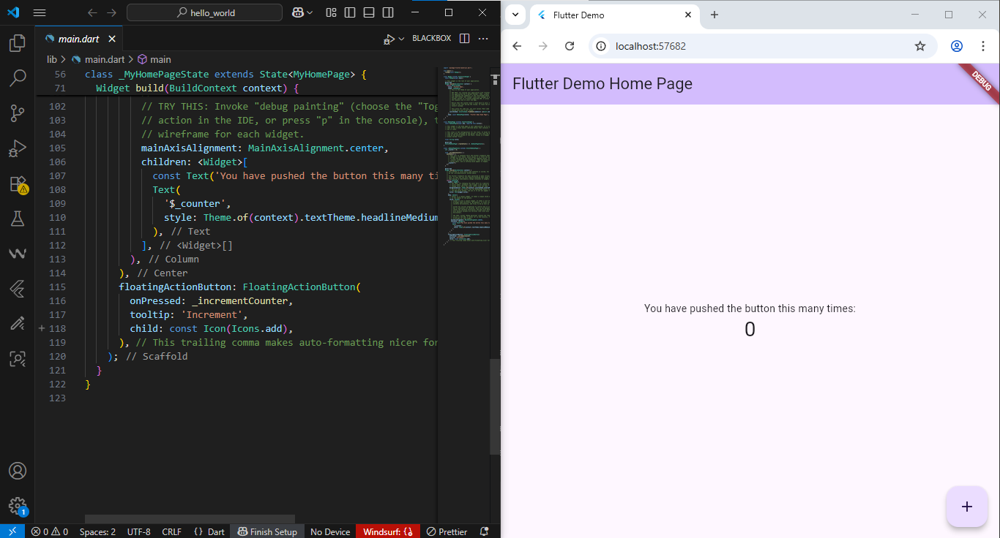
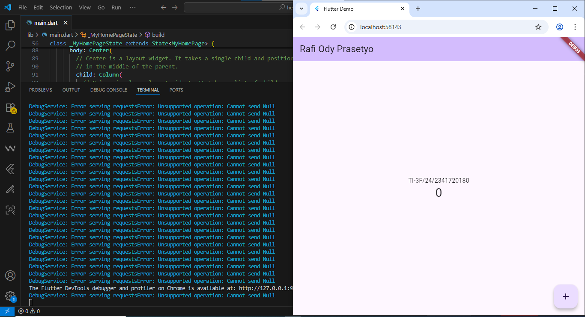
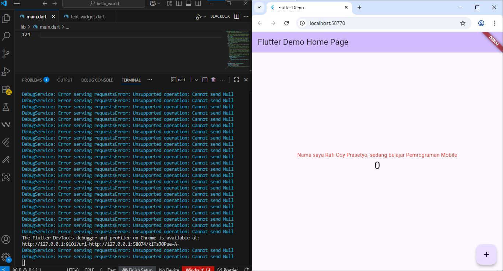
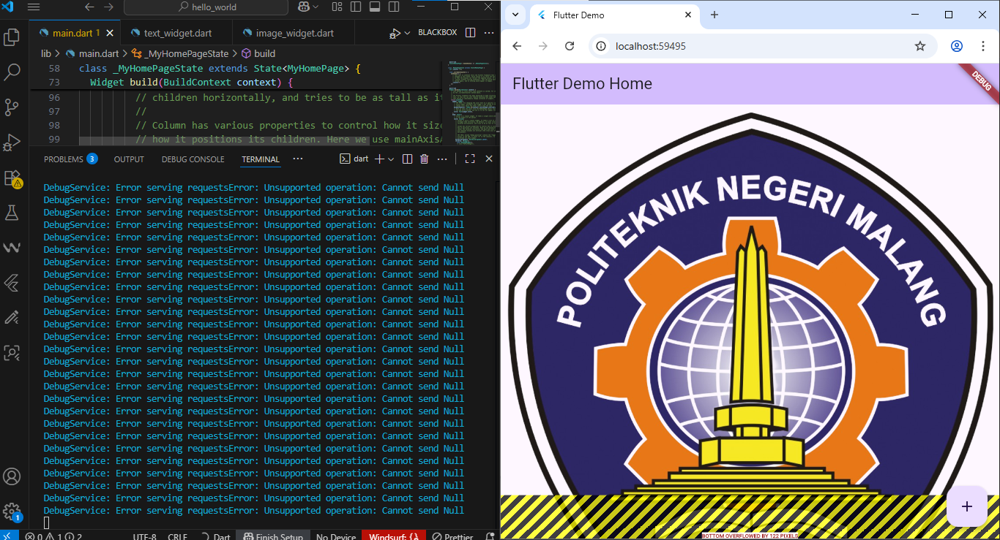
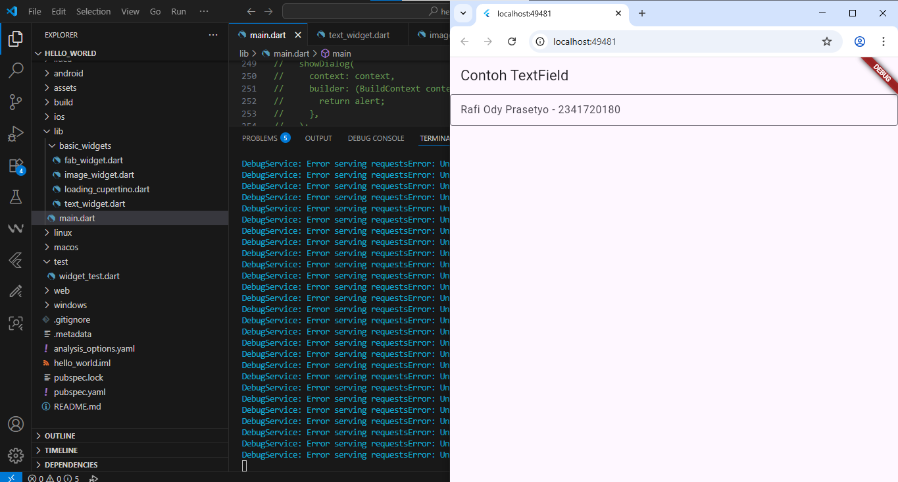
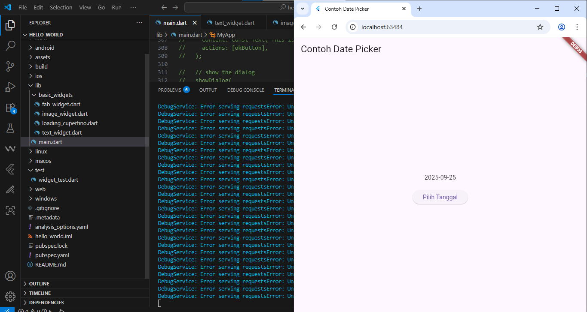
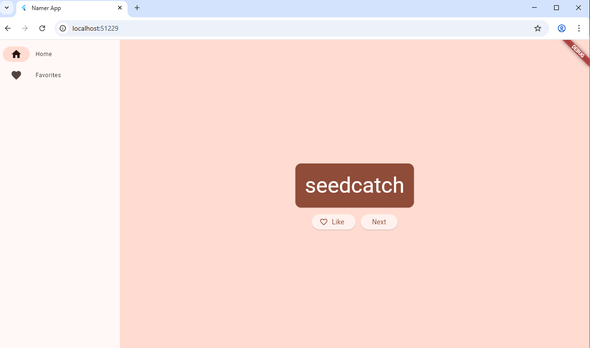
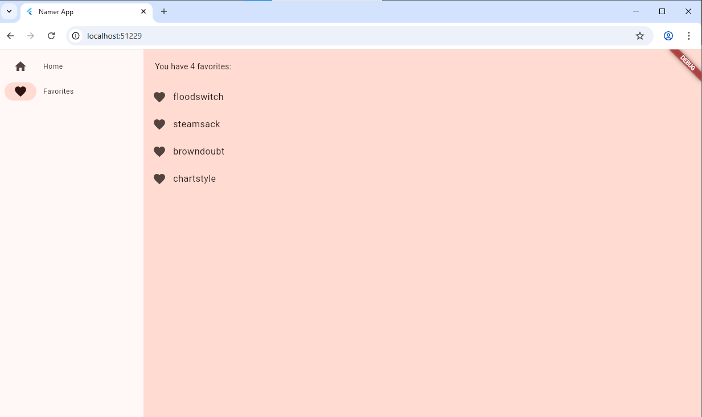

# Codelab 05

  * **Nama:** Rafi Ody Prasetyo
  * **NIM:** 2341720180
  * **Kelas:** TI-3F
  * **Absen:** 24

-----

# Praktikum 1: Membuat Project Flutter Baru

  Setelah dilakukan pembuatan project baru, pada terminal akan muncul pesan `All done!` yang menjadi konfirmasi utama bahwa proyek Flutter berhasil dibuat dan semua paket yang dibutuhkan telah terpasang. Secara bersamaan, seluruh struktur folder dan file proyek baru juga akan tampil di bagian sebelah kiri.

  
  

-----

# Praktikum 2: Menghubungkan Perangkat Android atau Emulator

  Setelah mengaktifkan mode developer di Android dan menyambungkannya via USB atau WiFi, kita dapat memeriksa langsung di Visual Studio Code untuk memastikan perangkat sudah terhubung.


  

  **Running project pada perangkat android:**

  .jpeg)

 -----

 # Praktikum 3: Membuat Repository GitHub dan Laporan Praktikum

  Menjalankan project 'hello_world', terlihat hasil dari eksekusi kode tersebut di mana aplikasi Flutter berhasil dikompilasi dan dijalankan bukan sebagai aplikasi mobile, melainkan sebagai aplikasi web yang interaktif di dalam browser Chrome. Ini menunjukkan salah satu keunggulan utama Flutter, yaitu kemampuannya untuk menargetkan berbagai platform dari satu basis kode yang sama, dalam hal ini platform web.
  

 Mengubah beberapa tampilan pada project `hello_world` dengan nama, nim, kelas, dan absen.

  

-----

# Praktikum 4: Menerapkan Widget Dasar

 ***Text Widget:***

 ```dart
    import 'package:flutter/material.dart';

    class MyTextWidget extends StatelessWidget {
     const MyTextWidget({Key? key}) : super(key: key);

     @override
     Widget build(BuildContext context) {
      return const Text(
       "Nama saya Fulan, sedang belajar Pemrograman Mobile",
       style: TextStyle(color: Colors.red, fontSize: 14),
       textAlign: TextAlign.center);
      }
    }
 ```

Widget ini digunakan untuk menampilkan sebuah teks di layar dengan konten "Nama saya Fulan, sedang belajar Pemrograman Mobile". Tampilan teks tersebut juga telah diatur secara spesifik agar berwarna merah, memiliki ukuran font 14, dan perataan teksnya berada di tengah.

 **Output:**

 
 

 ***Image Widget:***

 ```dart
 import 'package:flutter/material.dart';

 class MyImageWidget extends StatelessWidget {
  const MyImageWidget({Key? key}) : super(key: key);

  @override
  Widget build(BuildContext context) {
    return const Image(
      image: AssetImage("logo_polinema.jpg")
    );
  }
 }
 ```

Tugas utama widget ini adalah untuk menampilkan sebuah gambar yang diambil dari asset lokal di dalam proyek, yaitu file yang bernama logo_polinema.jpg. Sederhananya, ini adalah cara untuk membuat komponen gambar yang bisa digunakan kembali di dalam aplikasi.

 **Output:**

 
 

-----

# Praktikum 5: Menerapkan Widget Material Design dan iOS Cupertino

 .png)

 .png)

 .png)

 

 

 .png)

 Scaffold berfungsi sebagai kerangka dasar tata letak aplikasi, menyediakan struktur umum seperti app bar dan body, yang kemudian dilengkapi dengan Floating Action Button (FAB) untuk aksi utama. Untuk interaksi dengan pengguna, Dialog Widget dan Cupertino Button digunakan untuk menampilkan informasi penting dan menerima masukan, sementara Input and Selection Widget (seperti TextField dan Checkbox) serta Date and Time Pickers memungkinkan pengguna untuk memasukkan data spesifik. Terakhir, Loading Bar memberikan umpan balik visual kepada pengguna saat aplikasi sedang memproses sesuatu. Secara keseluruhan, kombinasi widget-widget ini memungkinkan developer untuk menciptakan aplikasi dengan pengalaman pengguna yang lengkap dan responsif.

 -----

 # Tugas Praktikum:

  1. Selesaikan Praktikum 1 sampai 5, lalu dokumentasikan dan push ke repository Anda berupa screenshot setiap hasil pekerjaan beserta penjelasannya di file README.md!
  2. Selesaikan Praktikum 2 dan Anda wajib menjalankan aplikasi hello_world pada perangkat fisik (device Android/iOS) agar Anda mempunyai pengalaman untuk menghubungkan ke perangkat fisik. Capture hasil aplikasi di perangkat, lalu buatlah laporan praktikum pada file README.md.
  3. Pada praktikum 5 mulai dari Langkah 3 sampai 6, buatlah file widget tersendiri di folder basic_widgets, kemudian pada file main.dart cukup melakukan import widget sesuai masing-masing langkah tersebut!
  4. Selesaikan Codelabs: Your first Flutter app, lalu buatlah laporan praktikumnya dan push ke repository GitHub Anda!

     


     

  5. README.md berisi: capture hasil akhir tiap praktikum (side-by-side, bisa juga berupa file GIF agar terlihat proses perubahan ketika ada aksi dari pengguna) dengan menampilkan NIM dan Nama Anda sebagai ciri pekerjaan Anda.
  6. Kumpulkan berupa link repository/commit GitHub Anda kepada dosen yang telah disepakati! 
