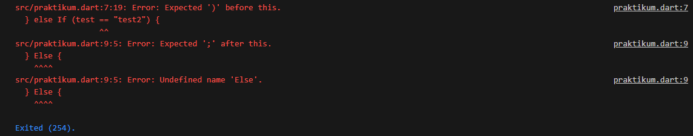
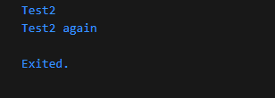
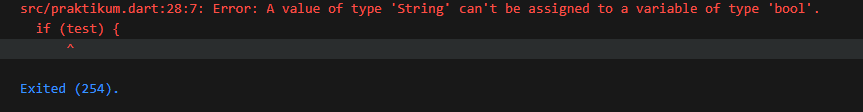
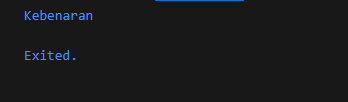
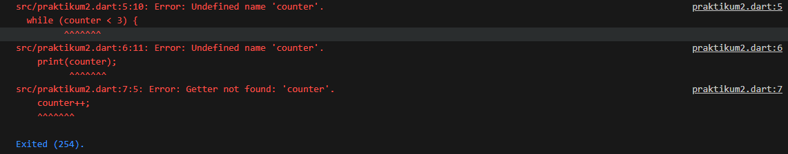
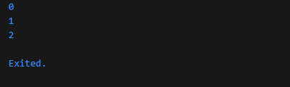
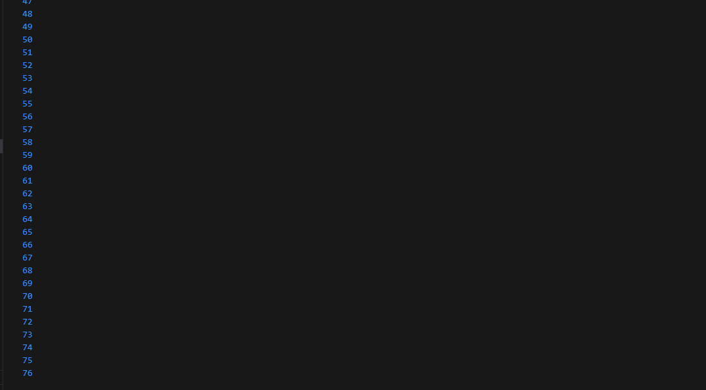
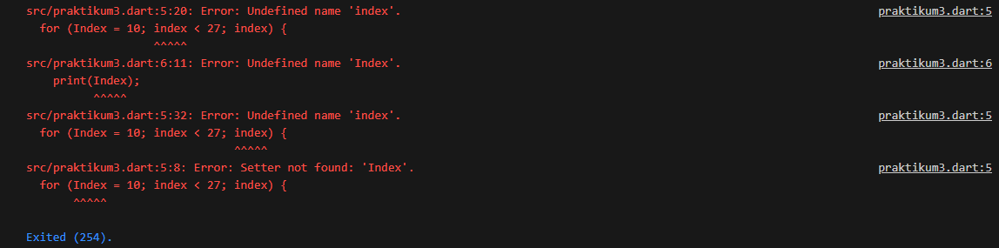
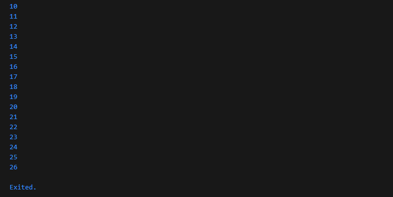

# Codelab 03 - Conditional and Loop

  * **Nama:** Rafi Ody Prasetyo
  * **NIM:** 2341720180
  * **Kelas:** TI-3F
  * **Absen:** 24

-----

# Praktikum 1 - Menerapkan Control Flows ("if/else")

  ***Langkah 1:*** Ketik/salin kode berikut pada `main()`

  ```dart
  String test = "test2";
  if (test == "test1") {
    print("Test1");
  } else If (test == "test2") {
    print("Test2");
  } Else {
    print("Something else");
  }

  if (test == "test2") print("Test2 again");
  ```

  ***Langkah 2:*** Kemudian eksekusi kode tersebut.

  **Output:**
  

  ***Penjelasan:*** Error disebabkan adanya kesalahan penulisan pada bagian `else If` dan `Else`. Penulisan yang benar adalah `else if` 
                    dan `else` tanpa ada awalan huruf besar.

  ***Perbaikan:***
  ```dart
  String test = "test2";
  if (test == "test1") {
    print("Test1");
  } else if (test == "test2") {
    print("Test2");
  } else {
    print("Something else");
  }
  ```

  **Output:**
  

  ***Langkah 3:*** Tambahkan kode program berikut, lalu coba eksekusi (Run).

  ```dart
  String test = "true";
  if (test) {
    print("Kebenaran");
  }
  ```

  **Output:**
  

  ***Penjelasan:*** Error disebabkan karena variabel `test` bertipe data `string`, tetapi digunakan sebagai `boolean` di dalam perulangan.

  ***Perbaikan:***
  ```dart
  String test = "true";

  if (test == "true") {
    print("Kebenaran");
  }
  ```

  **Output:**
  

-----

# Praktikum 2 - Menerapkan Perulangan "while" dan "do-while"

  ***Langkah 1:*** Ketik atau salin kode program berikut ke dalam fungsi main().

  ```dart
  while (counter < 33) {
    print(counter);
    counter++;
  }
  ```

  ***Langkah 2:*** Silakan coba eksekusi (Run) kode pada langkah 1 tersebut. Apa yang terjadi? Jelaskan! Lalu perbaiki jika terjadi error.

  **Output:**
  

  ***Penjelasan:*** Error terjadi karena variabel `counter` dipanggil dalam kode, tetapi sebelumnya belum pernah dideklarasikan atau diinisialisasi.

  ***Perbaikan:***

  ```dart
  int counter = 0;

  while (counter < 3) {
    print(counter);
    counter++;
  }
  ```
  Pada kode tersebut, `counter` berfungsi sebagai penghitung jumlah perulangan yang dijalankan. Oleh karena itu, variabel ini dapat dideklarasikan menggunakan tipe data `int`, atau menggunakan `var` agar lebih fleksibel.

  **Output:**

  

  ***Langkah 3:*** Tambahkan kode program berikut, lalu coba eksekusi (Run) kode Anda.

  ```dart
  do {
    print(counter);
    counter++;
  } while (counter < 77);
  ```

  **Output:**
  

  ***Penjelasan:*** Ketika kode pada langkah 3 dijalankan, program akan menampilkan output berupa angka dari 0 hingga 76. Hal ini terjadi karena perulangan `do-while` akan terus dijalankan selama nilai `counter` masih lebih kecil dari 77.

-----

# Praktikum 3 - Menerapkan Perulangan "for" dan "break-continue"

  ***Langkah 1:*** Ketik atau salin kode program berikut ke dalam fungsi main().

  ```dart
  for (Index = 10; index < 27; index) {
    print(Index);
  }
  ```

  ***Langkah 2:*** Silakan coba eksekusi (Run) kode pada langkah 1 tersebut. Apa yang terjadi? Jelaskan! Lalu perbaiki jika terjadi error.

  **Output:**
  

  ***Penjelasan:*** "Error terjadi karena variabel `Index` belum dideklarasikan dengan tipe data yang sesuai. Selain itu, terdapat inkonsistensi penulisan nama variabel pada bagian kondisi perulangan. Variabel yang digunakan adalah `Index`, tetapi pada kondisi ditulis `index`.

  ***Perbaikan:***

  ```dart
  for (int index = 10; index < 27; index++) {
    print(index);
  }
  ```
  **Output:**
  

  Perulangan dimulai dari `10` dikarenakan variabel `index` bernilai `10`. Perulangan akan berakhir ketika index bernilai 27.

